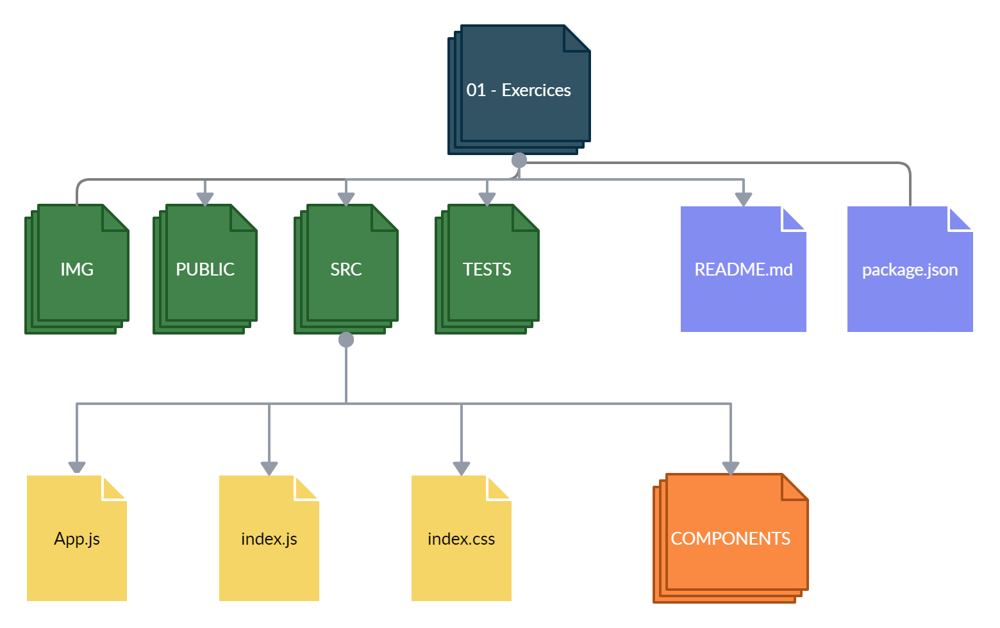

# HW 06: React-Intro | Ejercicios

## **Duración estimada 🕒**

2 horas

<br />

---

## **INTRO**

En esta homework, vamos a crear dos componentes de React, que nos ayudarán a entender mucho mejor cómo funciona esta grandiosa librería 😀

> **Nota**: No te preocupes por el estilo de los componentes. En la siguiente clase y homework nos dedicaremos a ello.

<br />

---

## **Pasos básicos para realizar la homework**

🔹 Para poder ejecutar los `test` de esta homework, es necesario que abramos la terminal ubicados dentro de la carpeta `01 - Exercises`.

-  Cuando te encuentres en esta carpeta, debes ejecutar el comando

```bash
npm install
```

-  Listo!! Ya puedes correr los test y levantar el proyecto con los comandos:

```bash
npm test
npm start
```

El primer test pasará sin que hagas nada, simplemente está para que te ayude a verificar que estás realizando correctamente los pasos y que no tienes errores.

<br />

Ingresando a <http://localhost:3000> desde el navegador, podremos ir viendo en tiempo real el resultado de nuestro trabajo.

<br />

---

### **ESTRUCTURA**

🔹 Dentro de la carpeta `01 - Exercises`, vas a encontrar la siguiente estructura:

-  Una carpeta llamada **img**
-  Una carpeta llamada **public**
-  Una carpeta llamada `src` (Es la carpeta en donde trabajaremos)
-  Una carpeta llamada **tests**
-  Un archivo **package.json**
-  Y el archivo `README.md` que ahora mismo estás leyendo. 🧐

Además:

🔹 Dentro de la carpeta `src` vas a encontrar ya el esqueleto del proyecto React, estructurado de la siguiente manera:

-  Una carpeta llamada `components`
-  Un archivo llamado **App.js**
-  Un archivo **index.css**
-  Un archivo **index.js**

🔹 Para estos ejercicios, trabajaremos sólo dentro la carpeta `components`. En principio sólo tenemos el componente `Bienvenido.jsx`.



<br />

---

## **👩‍💻 EJERCICIO 1**

### **Nuestro primer componente funcional de React**

🔹 En el archivo `Bienvenido.jsx` encontrarás definida la función de un componente funcional de React. Dentro de ella aplicaremos la magia de React para combinar los temas vistos en clase.

🔹 Lo que hay que hacer:

1. Que la función renderice un div.
2. Dentro de este div, crea la etiqueta correspondiente para un título h1 (puedes colocar el texto que desees).
3. Encontrarás una constante de tipo string llamada `studentName`, asígnale un texto con tu nombre. Dicha constante debe ser renderizada dentro de una etiqueta h3.
4. Encontrarás una constante llamada `techSkills` de tipo array, con 5 elementos. Los elementos de este arreglo deben renderizarse en una lista desordenada.

> Tip: para recorrer el arreglo y retornar elementos de acuerdo a su contenido, puedes usar el método `map`.

🔹 Resultado esperado:

<p align="center"></p>

<br />

---

## **👩‍💻 EJERCICIO 2**

🔹 Llegó la hora de crear tu primer componente desde cero

Ya sabemos cómo funciona un componente en React, ahora vamos a crear un componente desde cero, pero esta vez será un **_componente de clase_**.

🔹 Lo que hay que hacer:

1. Crea un componente de clase llamado `Botones.jsx` (click derecho sobre la carpeta components --> Nuevo archivo --> `Botones.jsx`)
2. Importa React desde 'react'.
3. Crea la función de clase llamada `Botones`.
4. El componente debe renderizar un div.
5. Dentro del div, renderiza un botón llamado "Módulo 1".
6. Dentro del div, renderiza un segundo botón llamado "Módulo 2".
7. Cada botón debe tener el atributo `onClick` que muestre un `alert` con cualquier texto. Para esto, puedes copiar el siguiente código para que te familiarices con la función **alert**.

```javascript
    onClick={() => alert('Tu mensaje')}
```

**...estamos llegando a la última parte de la homework** ⭐

Ahora necesitamos conectar estos dos componentes, ¿Cómo lo hacemos? Muy fácil!

1. Debes importar `Botones.jsx` dentro del componente `Bienvenido.jsx`
2. Debes renderizar `Botones.jsx`, como etiqueta en el componente `Bienvenido.jsx`
3. Dentro del componente `Bienvenido` debemos pasarle el objeto `alerts` como **_props_** al renderizar el componente `Botones`.
4. El componente `Botones.jsx` recibe por props del componente `Bienvenido.jsx` dicho objeto con dos propiedades: `m1` y `m2`. Estos serán renderizados dentro del alert que dispara cada botón.

> Para esta instancia deben pasar todos los tests. ✅ 🏆

🔹 Resultado esperado:

<p align="center"></p>

<p align="center"></p>

<br />

---

## **🧠 Recuerda que...**

-  Todo en React es un componente y existen dos tipos: los componentes funcionales y los componentes de clase.
-  Un componente funcional es una función de Javascript que puede o no recibir datos (props). Tanto el nombre de la función como el nombre del archivo se deben llamar igual y deben ser con mayúscula inicial.
-  Un componente de clase es otra manera de definir un componente, la diferencia radica en que el componente de clase es con sintaxis de ES5 y el componente funcional con ES6.
-  Las props o propiedades son la manera que tiene React para pasar parámetros de un componente padre a sus hijos.

<br />

---

## **🔎 Recursos adicionales**

-  Documentación [**Intro to React**](https://reactjs.org/tutorial/tutorial.html)

<br />

---

Listo!! Ahora estás preparado para crear tu propia app!! ✨🚀

Dirígete a la carpeta 📂 [**"02 - Integration"**](../02%20-%20Integration/README.md) y diviértete desarrollando la app de Rick & Morty 🤩
