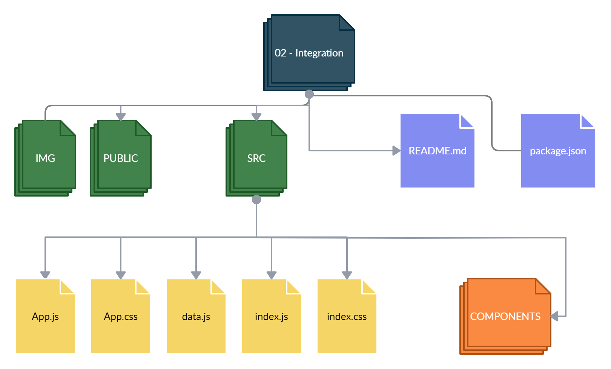
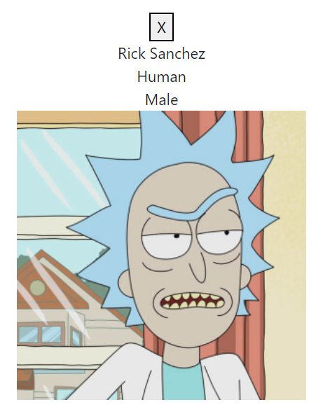
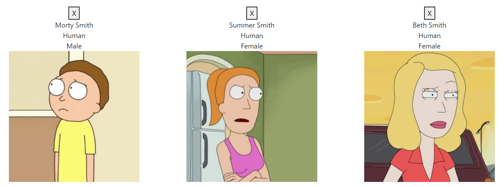
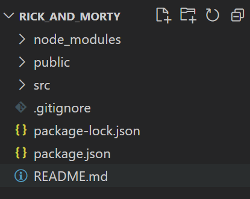
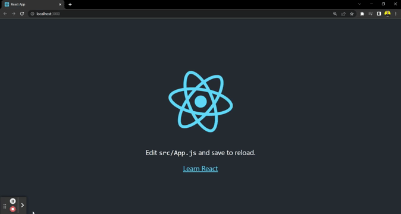

# HW 06: React-Intro | Integración

## **Duración estimada** 🕒

90 minutos

---

## **Rick & Morty App**

### **INTRO**

En esta homework, vamos a crear una serie de Componentes de React, que luego van a formar parte de nuestro primer desarrollo front-end.

> **Nota**: Todos los Componentes que hagamos en este homework son `Puros`, por lo tanto, ninguno tiene estado, simplemente reciben datos por props. No te preocupes por el estilo de los componentes. En la siguiente homework vamos a dárselos.

---

### **ESTRUCTURA**

🔹 Dentro de la carpeta `02 - Integration`, vas a encontrar la siguiente estructura:

-  Una carpeta llamada **img**
-  Una carpeta llamada **public**
-  Una carpeta llamada `src` (Es la carpeta en donde trabajaremos)
-  Un archivo **package.json**
-  Y el archivo `README.md` que ahora mismo estás leyendo. 🧐

Además:

🔹 Dentro de la carpeta `src` vas a encontrar ya el esqueleto del proyecto React, estructurado de la siguiente manera, donde deberás codear cada Componente:

-  Una carpeta llamada **components**
-  Un archivo llamado **App.css**
-  Un archivo llamado **App.js**
-  Un archivo llamado **data.js**
-  Un archivo **index.css**
-  Un archivo **index.js**

> **Nota**: Sabemos que los Componentes de React tienen que cumplir el principio de una única responsabilidad, es decir que cada Componente debe cumplir una única tarea bien definida.



---

## **PARTE 1**

---

### **COMENCEMOS**

Tu primer paso será ejecutar el comando `npm install` para instalar todas las dependencias.

En el archivo `App.js` ya tenemos importados y estamos renderizando los 3 componentes que vamos a codear. Revisa el código, verás que le estamos pasando props a estos componentes.

<br />

### **👩‍💻 01 - Haz el componente Character Card**

(`components/Card.js`)



Esta tarjeta va a mostrar el **nombre** de un personaje, su **especie**, **género** e **imagen**.

Además cuando el usuario haga click en la X de "cerrar", se invocará una función que también viene como props.

Este componente `Card` va a recibir las siguientes props:

-  **name**: Nombre
-  **species**: Especie
-  **gender**: Género
-  **image**: Imagen
-  **onClose**: La función que se va a ejecutar cuando el usuario haga click en el botón de cerrar.

> Más adelante todos estos datos van a venir de una API externa, pero por ahora no nos interesa esa parte. Por el momento nosotros te los vamos a brindar desde un archivo local **(src/data.js)**, para que ya puedas ver tu componente funcionando.

---

<br />

### **👩‍💻 02 - Haz el componente Cards**

(`components/Cards.js`)



Este Componente nos va a servir para renderizar **varios** componentes `Card`.

Básicamente, va a recibir un arreglo de `personajes` (con todos sus datos), y va a utilizar un componente `Card` (reutilizando el mismo que ya hicimos en el punto anterior) por cada uno de ellos, pasándole las props correspondientes.

> Tip: Usar el método `map` y devolver un componente `Card` por cada elemento del arreglo. [Acá](https://es.reactjs.org/docs/lists-and-keys.html#rendering-multiple-components) un ejemplo de la documentación de React.

---

<br />

### **👩‍💻 03 - Haz el componente de la de Barra de búsqueda**

(`components/SearchBar.js`)


Vamos a crear este componente para luego poder agregar más personajes que deseemos ver.

Este Componente recibe por props una función `onSearch`, dicha función recibe un parámetro (que más adelante será el ID del personaje tomado desde el input; pero de momento le pasamos uno cualquiera, ya que aún no estamos utilizando estados dentro del componente).

La función `onSearch` se debe ejecutar cuando se haga click en el botón `Agregar`.

<br />

---

## **PARTE 2**

---

### **¡Listo! Ahora creamos una app desde cero...**

¿Ya completaste los puntos anteriores y funciona todo? ¡Perfecto! Ya podemos comenzar a crear nuestra propia app:

1. En tu terminal, dirígete a un nuevo directorio (por ejemplo, tu escritorio). Allí es dónde crearemos nuestra app.

2. Ahora utiliza _CRA_ (create-react-app) mediante **npx** para crear una nueva app de React:

```bash
npx create-react-app rick_and_morty
```

> Hint: para el nombre de tu app no puedes usar mayúsculas ni el signo "&"

Al término del proceso, podrás ver que en tu directorio se creó una nueva carpeta llamada "rick_and_morty". Abre esta carpeta con tu Visual Studio Code. Allí encontrarás algo como esto:



3. Dentro de esta nueva carpeta tipeamos:

```bash
npm start
```

> Hint: Si aún tenemos corriendo el server local de la homework Integration Parte 1, vamos a obtener un error debido a que el puerto predeterminado (3000) está ocupado. Podemos elegir utilizar otro puerto, o terminar el proceso anterior y luego reintentarlo.

Esperamos que se "levante" el servidor local y luego veremos algo así:



-  Ahora simplemente tendrás que reemplazar la carpeta `/src` de este nuevo proyecto que acabas de crear, por la misma carpeta en la que estuviste trabajando dentro de esta homework.

En el navegador ya deberías ver los cambios. Lo que hicimos en la homework Integration Parte 1 está corriendo como una app independiente.

Listo! Ya tienes tu primer app hecha con React 👏🏼🚀
