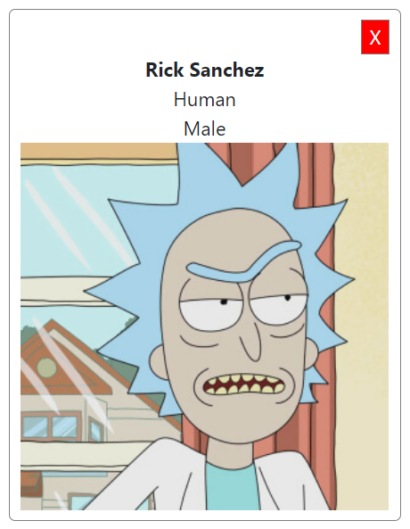

# Homework React-Intro

## Rick & Morty App

En este homework, vamos a crear una serie de Componentes de React, que luego van a formar parte de nuestro primer desarrollo front-end.

> **Nota**: Todos los Componentes que hagamos en este homework son `Puros` o `Funcionales`, por lo tanto, ninguno tiene estado, simplemente reciben datos por props.
>
> No te preocupes por el estilo de los componentes. En el homework siguiente vamos a darle Estilos.

En la carpeta `src` vas a encontrar ya el esqueleto del proyecto React, y los archivos donde deberás codear cada Componente.

Sabemos que los Componentes de React tiene que cumplir el principio de una sóla responsabilidad, es decir que cada Componente debé cumplir una sóla tarea bien definida. Los Componentes que vamos a codear son:

---

## Character Card

(`components/Card.js`)

Esta tarjeta va a mostrar el nombre de un personaje, su especie, género e imagen.

Además cuando el usuario haga click en la X de "cerrar", se invocará una función que tambien viene como props.



Este Componente va a recibir las siguientes props:

- **name**: Nombre
- **species**: Especie
- **gender**: Género
- **image**: Imágen
- **onClose**: La función que se va a ejecutar cuando el usuario haga click en el botón de cerrar.

Todos estos datos van a venir de una API externa, pero por ahora no nos interesa esa parte. Nosotros te vamos a dar datos de prueba para que puedas ver tu componente funcionando.

---

## Cards

(`components/Cards.js`)

Este Componente nos va a servir para renderizar muchos Componentes `Cards`. Básicamente, este componente va a recibir un arreglo de `personajes` (con todos sus datos), y va a crear un componente `Card` por cada uno de ellos, pasándole las props correspondientes.


> Tip: Podés usar la función `map` y devolver un componente `Card` por cada elemento del arreglo. [Acá](https://es.reactjs.org/docs/lists-and-keys.html#rendering-multiple-components) un ejemplo de la documentación de React.

---

## Barra de búsqueda

(`components/SearchBar.js`)

Este componente se va a utilizarse para luego poder encontrar las ciudades sobre las cuales se desee ver el clima actual.


Este Componente recibe por props una función `onSearch` que recibe un parámetro (que será el nombre de la ciudad tomado desde el input pero de momento pueden pasarle uno cualquiera ya que aún no estamos utilizando estados dentro del componente). La función `onSearch` se debe ejecutar cuando se haga click en el botón `Agregar`.

### Instrucciones para correr el proyecto

Desde la carpeta `homework` se pueden ejecutar los siguientes comandos:

```bash
npm install
```

Instala todas las dependecias necesarias para correr el proyecto correctamente

```bash
npm start
```

Comienza a correr la aplicación de forma local por lo que se puede ver desde el navegador accediendo a <http://localhost:3000>

>No es necesario volver a correr el proyecto cada vez que se realice un cambio sino que se verá automáticamente reflejando en el navegador.

---

## Creemos una app desde cero

Ya completaste los puntos anteriores y funciona todo? Perfecto! Ya podemos comenzar a crear nuestra propia app:

1. En una carpeta fuera de este repo, usamos CRA (create-react-app) para crear una nueva app de React:
<!-- Instrucciones? ^^^^  -->

```bash
npx create-react-app rick_and_morty
```

> Hint: para el nombre de tu app no puedes usar mayúsculas ni el signo "&"

Al término del proceso, nos va a quedar una carpeta con el siguiente contenido:


2. Dentro de esta nueva carpeta tipeamos:

```bash
npm start
```

> Hint: procuremos cerrar la terminal o terminar el proceso anterior si aún estabamos corriendo el front de la homework. De lo contrario podemos obtener un error por el puerto ya ocupado. Si eso sucede, terminamos el servidor anterior (CTRL+C) y reintentamos.

Esperamos que se "levante" el servidor local y luego veremos algo así:


