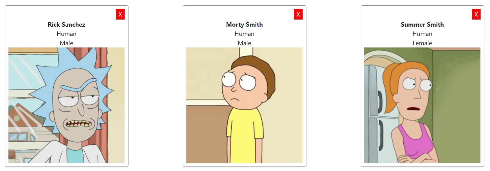
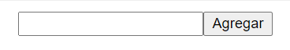

## Henry Weather Card

### Ejercicio

En este homework, vamos a crear una serie de Componentes de React que luego vamos a usar en el próximo homework.

> **Nota**: Todos los Componentes que hagamos en este homework son `Puros` o `Funcionales`, por lo tanto, ninguno tiene estado, simplemente reciben datos por props.
>
> No te preocupes por el estilo de los componentes. En el homework de mañana vamos a darle Estilos.

En la carpeta `src` vas a encontrar ya el esqueleto del proyecto React, y los archivos donde deberás codear cada Componente.

Sabemos que los Componentes de React tiene que cumplir el principio de una sóla responsabilidad, es decir que cada Componente debé cumplir una sóla tarea bien definida. Los Componentes que vamos a codear son:

#### Weather Card (`components/Card.js`)

Esta tarjeta va a mostrar el nombre de una ciudad, con su temperatura máxima y mínima, y con una imagen que representa el estado del clima (soleado, nublado, etc..), además cuando el usuario haga click en la X de cerrar, se invocará una función que tambien viene como props.

Este Componente va a recibir las siguientes props:
- **max**: Temperatura Máxima.
- **min**: Temperatura Mínima.
- **name**: Nombre de la ciudad.
- **img**: nombre de la imagen que se debe mostrar.
- **onClose**: recibe una función que se va a ejecutar cuando el usuario haga click en el botón de cerrar.

Todos estos datos van a venir de una API de clima, pero por ahora no nos interesa esa parte. Nosotros te vamos a dar datos de prueba para que puedas ver tu componente funcionando.

__IMPORTANTE:__ Para poder obtener la imagen correspondiente desde la API del clima deben utilizar la siguiente URL `http://openweathermap.org/img/wn/${img}@2x.png` donde img debería ser el código del icono asociado a la imagen que recibe como prop. Por ejemplo: http://openweathermap.org/img/wn/02d@2x.png

#### Cards (`components/Cards.js`)

Este Componente nos va a servir para renderizar muchos Componentes `Cards`. Básicamente, este componente va a recibir un arreglo de `ciudades` (con todos sus datos), y va a crear un componente `Card` por cada ciudad, pasandole las props correspondientes.

> Tip: Podés usar la función `map` y devolver un componente `Card` por cada elemento del arreglo. [Acá](https://es.reactjs.org/docs/lists-and-keys.html#rendering-multiple-components) un ejemplo de la documentación de React.

#### Barra de búsqueda (`components/SearchBar.js`)

Este componente se va a utilizarse para luego poder encontrar las ciudades sobre las cuales se desee ver el clima actual.

Este Componente recibe por props una función `onSearch` que recibe un parámetro (que será el nombre de la ciudad tomado desde el input pero de momento pueden pasarle uno cualquiera ya que aún no estamos utilizando estados dentro del componente). La función `onSearch` se debe ejecutar cuando se haga click en el botón `Agregar`.

### Instrucciones para correr el proyecto

Desde la carpeta `homework` se pueden ejecutar los siguientes comandos:

#### `npm install`

Instala todas las dependecias necesarias para correr el proyecto correctamente

#### `npm start`

Comienza a correr la aplicación de forma local por lo que se puede ver desde el navegador accediendo a
http://localhost:3000

>No es necesario volver a correr el proyecto cada vez que se realice un cambio sino que se verá automáticamente reflejando en el navegador.
