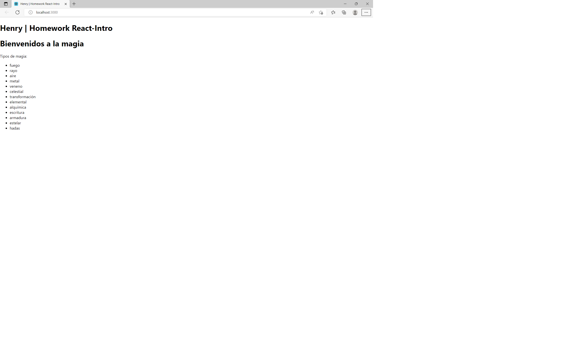

# Módulo: Módulo 2 - Front End
# Lecture: React-Intro

## Temas de la clase:

◻️ React

◻️ Componente

◻️ JSX

◻️ Componentes funcionales y componentes de clase

◻️ Props

◻️ Webpack

---

## Aprendizaje esperado

Al finalizar esta homework habrás aprendido a crear componentes de React tanto funcionales como de clase, entenderás el propósito de las props, cómo trabaja Javascript con HTML y podrás aplicar todos estos conocimientos en la app de integración.

---
## Consigna de la homework

En esta homework, vamos a crear dos componentes de React, que nos ayudarán a entender mucho mejor cómo funciona esta grandiosa librería 😀.

> **Nota**: No te preocupes por el estilo de los componentes. En la siguiente homework practicaremos un poco sobre estilos.

◻️ El primer componente "Bienvenido.jsx" lo encontrarás ya creado y su función predefinida.

◻️ El segundo componente "Botones.jsx" lo deberás crear desde cero como un componente de clase.

---
## Pasos básicos para realizar la homework

◻️ Para poder ejecutar los `test` de esta homework, es necesario que estemos ubicados dentro de la carpeta `exercises` utilizando el comando "cd + nombreCarpeta.

* Cuando te encuentres en esta carpeta, debes ejecutar el comando `npm install` o `npm i`.

* Listo!! Ya puedes correr los test con el comando `npm test`

◻️ Para poder correr la aplicación de forma local solo debes ejecutar el comando `npm start`. 

* Verás en el navegador lo que vamos trabajando accediendo a <http://localhost:3000>
>**Nota**: No es necesario volver a correr el proyecto cada vez que se realice un cambio, el mismo se verá automáticamente reflejando en el navegador.

---
## Conociendo la estructura...

Dentro de la carpeta `exercises`, vas a encontrar la siguiente estructura:

🔹 Una carpeta llamada `img`

🔹 Una carpeta llamada `public`

🔹 Una carpeta llamada `src` (Es la carpeta en donde trabajaremos)

🔹 Una carpeta llamada `tests`

🔹 Un archivo package.json

🔹 Y el archivo README que ahora mismo estás leyendo. 🧐

---
## Comencemos...👨‍💻👩‍💻

🔹 Dentro de la carpeta `src` en la que vas a encontrar ya el esqueleto del proyecto React, estructurado de la siguiente manera:

* Una carpeta llamada components (dentro de ella realizarás los ejercicios)

* Un archivo llamado App.js

* Un archivo index.js

* Un archivo index.css (estilos)

🔹 Trabajaremos en la carpeta `components` en ella por ahora solo tenemos el componente "Bienvenido.jsx".

🔹 En el componente `Bienvenido.jsx` encontrarás la función predefinida de un componente funcional, dentro de ella aplicaremos la magia de React para combinar los temas vistos en clase, para ello necesitamos:

* Que la función retorne un div.
* Dentro de este div, crea la etiqueta correspondiente para un título (puedes colocar el texto que desees).
* Crea una constante de tipo string llamada `subTitle`.
* Asígnale un texto.
* La constante debe retornar en un h3.
* Encontrarás una constante llamada `magicTypes` de tipo array, asígnale mínimo 5 elementos.
* Este arreglo debe retornar en una lista desordenada que enliste los elementos.
> Tip: para recorrer el arreglo puedes usar el método `map`.

* El componente debe verse en el navegador similar a esta imagen:

    

🔹 Llegó la hora de crear tu primer componente desde cero. 

---
## Duración estimada

45 minutos

---
## Recuerda que... 

Estos ejercicios nos ayudarán a comprender los conceptos vistos en clase y a la hora de realizar la homework-integration.

---

---

## Ejercicio 2️⃣

Para este ejercicio ya sabemos cómo funciona un componente en React, ahora vamos a crear un componente desde cero. Haz click derecho sobre la carpeta "components" --> Nuevo archivo --> Botones.jsx, crea el componente guiándote del ejercicio anterior; sin embargo, para este ejercicio el componente tendrá lo siguiente:

🔵 Importar el componente "Botones" en el componente "Bienvenido".

🔵 Renderiza el componente "Botones" debajo de la lista desordenada.

🔵 El componente "Botones" recibe props.

🔵 Un botón llamado "Ocultar" que al hacer click sobre él, los tipos de magia del componente "Bienvenido" se oculten.

🔵 Un botón llamado "Mostrar" que vuelva nuevamente visible los tipos de magia del componente "Bienvenido".

---

Listo! Ahora estás preparado para crear tu propia app!! ✨🚀

Dirígete a la carpeta 📂<b>"homework-integration"</b> y diviértete desarrollando la app de Rick & Morty 🤩