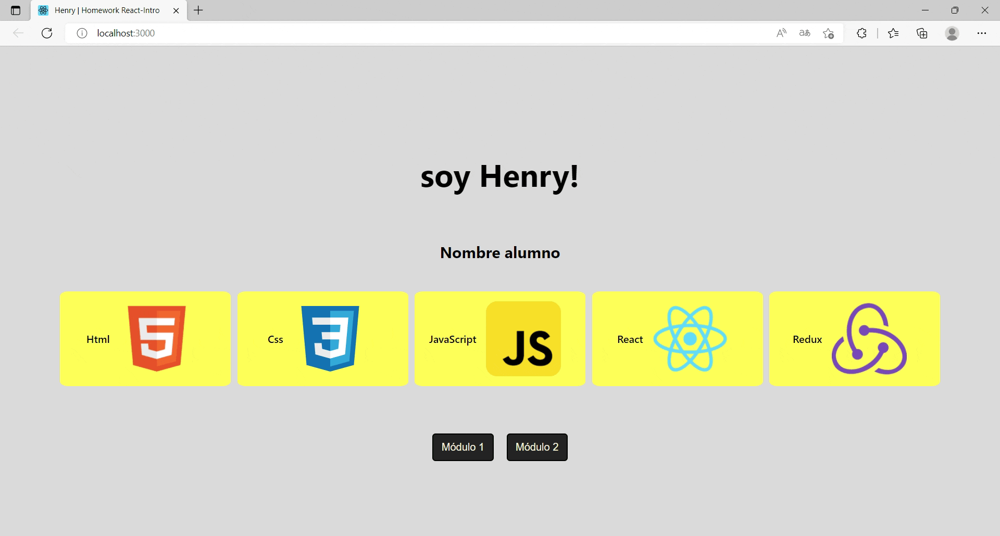

# HW 02 - React-Estilos | Ejercicios

## Duración estimada 🕒

60 minutos

---

## Consigna de la homework

En esta homework, aprenderemos a utilizar las diferentes formas de aplicar estilos en React 🎨.

◻️ Aplicaremos al componente "Bienvenido.jsx" `module.css` e `inline styling`.

◻️ Aplicaremos al componente "Botones.jsx" `styled components`.

---

### Pasos básicos para realizar la homework

◻️ Para poder ejecutar los `test` de esta homework, es necesario que estemos ubicados dentro de la carpeta `01 - Exercises`.

* Cuando te encuentres en esta carpeta, debes ejecutar el comando `npm install` (o `npm i`).

* Listo!! Ya puedes correr los test con el comando `npm test` (o `npm t`). Los dos primeros pasarán sin que hagas nada, simplemente están para que te ayuden a verificar que estás realizando correctamente los pasos y que no tienes errores.

◻️ Para poder correr la aplicación de forma local, sólo debes ejecutar el comando `npm start`.

* Ingresando a <http://localhost:3000> desde el navegador, podremos ir viendo en tiempo real el resultado de nuestro trabajo.

---

### Conociendo la estructura

Dentro de la carpeta `01 - Exercise`, vas a encontrar la siguiente estructura:

🔹 Una carpeta llamada `_mocks_`

🔹 Una carpeta llamada `public`

🔹 Una carpeta llamada `src` (Es la carpeta en donde trabajaremos)

🔹 Una carpeta llamada `tests`

🔹 Un archivo package.json

🔹 Y el archivo README que ahora mismo estás leyendo. 🧐

---

## 👩‍💻 Ejercicio 1

🔹 Dentro de la carpeta `src` encontrarás el esqueleto del proyecto React, estructurado de la siguiente manera:

* Una carpeta llamada assets

* Una carpeta llamada components

* Un archivo llamado App.js

* Un archivo index.js

* Un archivo index.css (estilos)

🔹 Para estos ejercicios, trabajaremos sólo dentro la carpeta `components`. Dentro de esta carpeta encontrarás:

* Una carpeta llamada Bienvenido, la cual a su vez contiene:

    * El componente Bienvenido.jsx

    * La hoja de estilos Bienvenido.module.css

* Una carpeta llamada Botones, la cual a su vez contiene:

    * El componente Botones.jsx

**1. Comencemos con la carpeta Bienvenido:**

◻️ Abre el archivo Bienvenido.module.css, dentro de él encontrarás las clases con sus estilos.

◻️ Abre el archivo Bienvenido.jsx, dentro de él encontrarás:

* El import de la librería react, los archivos en formato de imagen y el archivo Bienvenido.module.css **(que debes descomentar para poder empezar a trabajar)**

* Las constantes studentName, techSkills y alerts que vimos en la homework anterior. 

* La función Bienvenido que renderiza:

    1. Un div.
    2. Dentro de este div, se renderiza:

        a. Un h1

        b. Un h3

        c. Una ul (lista desordenada)

        -  Dentro de la ul se renderizan varios li (ítems de lista) correspondientes al array de techSkills.

        d. El componente Botones.

🔹 Debes aplicar la clase que corresponda al elemento JSX usando el atributo className. Por ejemplo:

```html
<div className={s.classExample}>Example</div>
```

---

## 👩‍💻 Ejercicio 2

### Continuamos con la carpeta Botones

Ya sabemos cómo funciona y se conectan los archivos module.css a nuestros componentes, ahora vamos a estilar desde cero en nuestro componente Botones, pero esta vez será aplicando `Styled Components`, para ello debes seguir los siguientes pasos:

1. En el componente `Botones.jsx`, importa `styled` desde "styled-components"`

2. Encontrarás una constante llamada `DivButtons`, la cual debe contener mínimamente los siguientes estilos para el div:
    * `display: flex`
    * `flex-direction: row`

 Por ejemplo:

```jsx
const DivExample = styled.div`
    width: 100vw; 
    height: 100 hw`
```

3. Encontrarás una constante llamada `Buttons`, la cual debe contener mínimamente los estilos para los botones:
    * `border-radius: 5px`
    * `margin: 10px`
    * `padding: 5px`

4. Cambia las etiquetas por las constantes mencionadas anteriormente. Por ejemplo:

```html
<div></div> 

//cambiaría por: 

<DivExample></DivExample>
```

> **Nota**: Para los estilos puedes guiarte del ejercicio anterior. 💡

**...Estamos llegando a la última parte de la homework** ⭐

---

## 👩‍💻 Ejercicio Extra

🔹 Aplica estilo al h1 utilizando `inline styling`.

* El componente debe verse en el navegador similar a esta imagen:

<p align="center"></p>

---

## Recordemos que...

🔹 Puedes utilizar cualquiera de los métodos enseñados en clase y practicados en este ejercicio para aplicar estilos en React.

🔹 Si vas a utilizar styled componentes, las variables const deben ser con mayúscula inicial.

🔹 Para utilizar estilos en línea o inline styling, debes usar el atributo 'style', estableciendo su valor como un objeto de javascript.

🔹 Si utilizas module.css el alcance de tu css será local y evitarás conflictos como pisar estilos en tu proyecto.

🔹 Aplicar estilos es como pintar un cuadro, no hay límites en la imaginación y creatividad, sin olvidarnos de dar a los usuarios la mejor experiencia. 😃

---

## Recursos adicionales

Documentación **"Styled Components"** <https://styled-components.com/docs/basics>

Documentación **"CSS"** <https://www.w3schools.com/css/default.asp>

---

Listo!! Ahora estás preparado para estilar tu app!! 👨‍🎨👩‍🎨✨🚀

Dirígete a la carpeta 📂 **"02 - Integration"** y diviértete estilando la app de Rick & Morty 🤩
