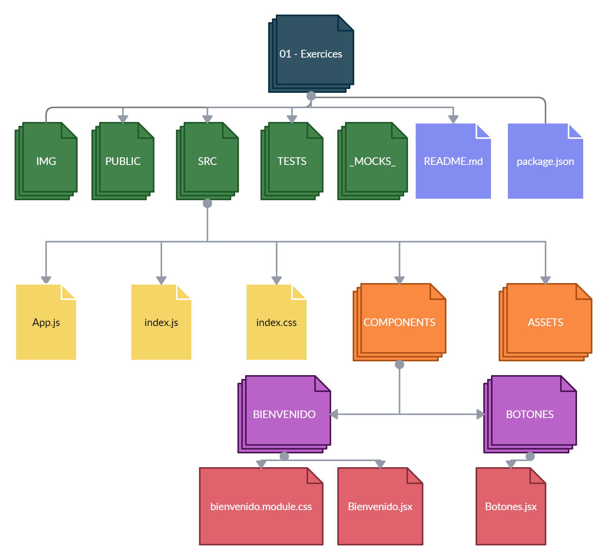
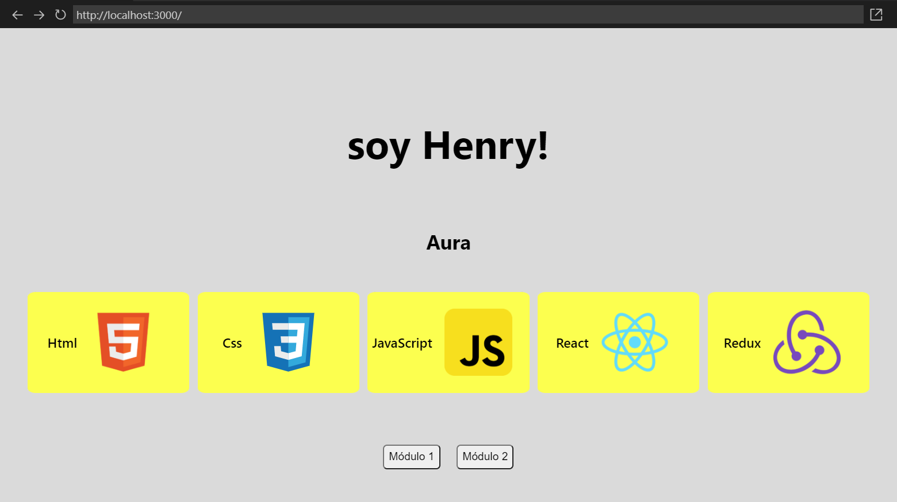
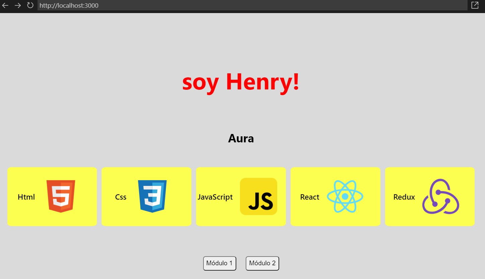

# HW 07 - React-Estilos | Ejercicios

## **Duración estimada 🕒**

2 horas

<br />

---

## **Consigna de la homework**

En esta homework, aprenderás a utilizar las diferentes formas de aplicar estilos en React 🎨

-  Aplicarás al componente **Bienvenido.jsx** `module.css` e `inline styling`.
-  Aplicarás al componente **Botones.jsx** `styled components`.

<br />

---

## **Pasos básicos para realizar la homework**

🔹 Para poder ejecutar los `test` de esta homework, es necesario que abras la terminal ubicados dentro de la carpeta `01 - Exercises`.

-  Cuando te encuentres en esta carpeta, debes ejecutar el comando:

```bash
npm install
```

-  Listo!! Ya puedes correr los test y levantar el proyecto con los comandos:

```bash
npm test
npm start
```

Los dos primeros test pasarán sin que hagas nada, simplemente están para que te ayuden a verificar que estás realizando correctamente los pasos y que no tienes errores.

<br />

-  Ingresando a <http://localhost:3000> desde el navegador, podrás ir viendo en tiempo real el resultado de tu trabajo.

<br />

---

## **ESTRUCTURA**

🔹 Dentro de la carpeta `01 - Exercises`, vas a encontrar la siguiente estructura:

-  Una carpeta llamada **mocks**
-  Una carpeta llamada **img**
-  Una carpeta llamada **public**
-  Una carpeta llamada `src` (Es la carpeta en donde trabajarás)
-  Una carpeta llamada **tests**
-  Un archivo **package.json**
-  Y el archivo `README.md` que ahora mismo estás leyendo. 🧐

Además:

🔹 Dentro de la carpeta `src` encontrarás el esqueleto del proyecto React, estructurado de la siguiente manera:

-  Una carpeta llamada **assets**
-  Una carpeta llamada `components`
-  Un archivo llamado **App.js**
-  Un archivo **index.css**
-  Un archivo **index.js**

🔹 Para estos ejercicios, trabajarás sólo dentro la carpeta `components`. Dentro de esta carpeta encontrarás:

-  Una carpeta llamada **Bienvenido**, la cual a su vez contiene:
   -  El componente `Bienvenido.jsx`
   -  La hoja de estilos `Bienvenido.module.css`
-  Una carpeta llamada **Botones**, la cual a su vez contiene:

   -  El componente `Botones.jsx`

   

   <br />

---

## **👩‍💻 EJERCICIO 1**

### **Dando estilos al componente Bienvenido**

🔹 Abre y revisa el archivo `Bienvenido.module.css`, dentro de él encontrarás las clases con sus estilos.

🔹 Abre el archivo `Bienvenido.jsx`, dentro de él encontrarás:

-  El import de la librería **React**, el componente **Botones**, los archivos en formato de imagen y el archivo `Bienvenido.module.css` **(que debes descomentar para poder empezar a trabajar)**

-  Las constantes `studentName`, `techSkills` y `alerts` que viste en la homework anterior.

-  La función Bienvenido que renderiza:

1. Un div.
2. Dentro de este div, se renderiza:
   -  Una etiqueta h1
   -  Una etiqueta h3 que renderiza el nombre del alumno
   -  Una etiqueta ul (lista desordenada)
      -  Dentro de la etiqueta ul se renderizan varias etiquetas li (ítems de lista) correspondientes al array de `techSkills`
   -  El componente `Botones`

🔹 Lo que hay que hacer:

Debes aplicar la clase que corresponda a cada elemento **HTML** usando el atributo `className`. Por ejemplo:

```html
<div className="{styles.classExample}">Example</div>
```

<br />

---

## **👩‍💻 EJERCICIO 2**

### **Continúa con la carpeta Botones**

Ya sabes cómo funciona y se conectan los archivos module.css a los componentes, ahora estila desde cero en el componente Botones, pero esta vez será aplicando `Styled Components`, para ello debes seguir los siguientes pasos:

1. En el componente `Botones.jsx`, importa `styled` desde "styled-components"`
2. Encontrarás una constante llamada `DivButtons`, la cual debe contener mínimamente los siguientes estilos para el div:
   -  `display: flex;`
   -  `flex-direction: row;`
   -  `justify-content: space-around;`
   -  `align-items: center;`

Por ejemplo:

```jsx
const DivExample = styled.div`
   width: 100vw;
   height: 100 hw;
`;
```

3. Encontrarás una constante llamada `Buttons`, la cual debe contener mínimamente los estilos para los botones:

   -  `border-radius: 5px;`
   -  `margin: 10px;`
   -  `padding: 5px;`

4. Cambia las etiquetas por las constantes mencionadas anteriormente. Por ejemplo:

```html
<div></div>

//cambiaría por:

<DivExample></DivExample>
```

🔹 Resultado esperado:

<p align="center"></p>

> **Nota**: Para los estilos puedes guiarte del ejercicio anterior. 💡

> Para esta instancia deben pasar todos los tests. ✅ 🏆

<br />

---

## **📌 EJERCICIO EXTRA**

🔹 Volviendo al componente Bienvenido, aplica estilo a la etiqueta h1, utilizando `inline styling`. Intenta cambiar su color a rojo, "pisando" el estilo que se aplica por CSS Modules.

El componente debe verse en el navegador similar a esta imagen:

<p align="center"></p>

<br />

---

## **🧠 Recuerda que...**

-  Puedes utilizar cualquiera de los métodos enseñados en clase y practicados en este ejercicio para aplicar estilos en React.
-  Si vas a utilizar `styled components`, el nombre de las variables `const` deben comenzar con mayúscula.
-  Para utilizar estilos en línea o `inline styling`, debes usar el atributo `style`, estableciendo su valor **como un objeto de javascript**.
-  Si utilizas `CSS Modules`, el alcance de tus estilos será local para cada componente y evitarás conflictos como pisar estilos en tu proyecto. Es necesario que la extensión de los archivos donde se definan los estilos sea `.module.css`.
-  Aplicar estilos es como pintar un cuadro, no hay límites en la imaginación y creatividad, sin olvidarnos de dar a los usuarios la mejor experiencia. 😃

<br />

---

## **🔎 Recursos adicionales**

-  Documentación [**Styled Components**](https://styled-components.com/docs/basics)
-  Documentación [**CSS**](https://www.w3schools.com/css/default.asp)

<br />

---

Listo!! Ahora estás preparado para estilar tu app!! 👨‍🎨👩‍🎨✨🚀

Dirígete a la carpeta 📂 [**"02 - Integration"**](../02%20-%20Integration/README.md) y diviértete dando estilos la app de Rick & Morty 🤩
