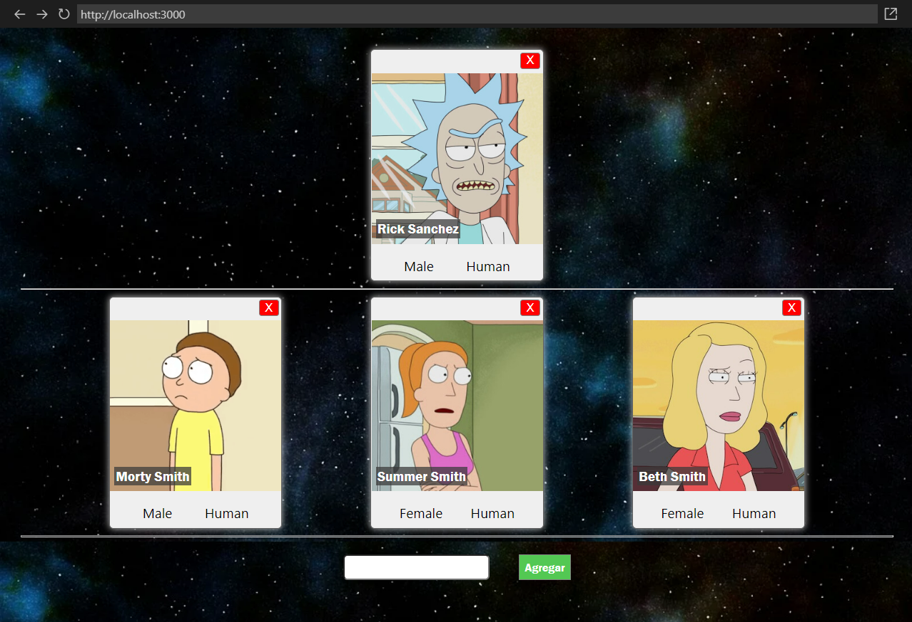

# HW 07 - React-Estilos | Integración

## **Duración estimada 🕒**

Dependerá de todo el amor que le quieras colocar a tu app 💛

<br />

---

## **INTRO**

En este homework vas a utilizar `CSS Modules` o `Styled Components` (tú eliges) para dar estilos a los componentes que hicimos la clase anterior.

🔹 Vas a trabajar directamente sobre la app que creamos en la homework anterior con CRA (create-react-app). Nuestra App de **_Rick & Morty_**.

-  En caso de utilizar `Styled Components`, debemos instalar dicha dependencia, desde la carpeta raíz de nuestro proyecto de **_Rick & Morty:_**

```bash
npm install styled-components
```

-  En caso de utilizar `CSS Modules` es necesario que la extensión de los archivos donde se definan los estilos sea `.module.css` (Por ejemplo: `Card.module.css`)

<br />

---

## **👩‍💻 EJERCICIO 1**

Tu tarea consiste en agregar estilos CSS para que los componentes de tu App de **_Rick&Morty_** queden muy _lindos!_

No hay consignas que debas seguir, puedes darle tu toque personal. **Sé creativo/a!** 🧑‍🎨

Recuerda que debes trabajar sobre tu proyecto de integración (que no está en este repositorio)

🔹 Resultado esperado:


