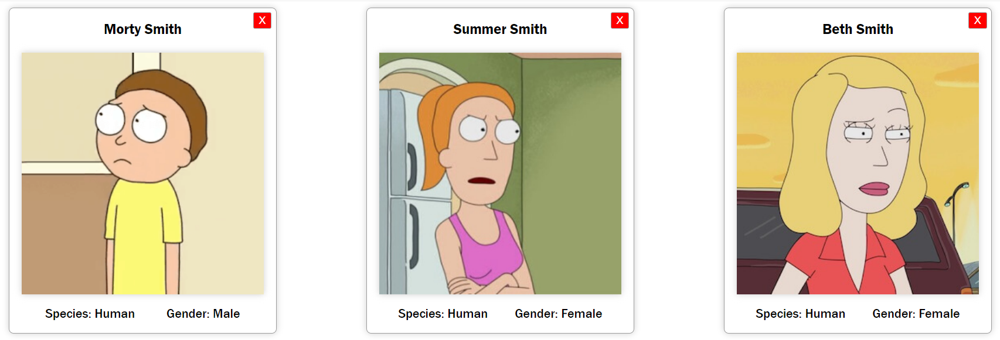

# Henry

## Estilos

En este homework vas a utilizar CSS Modules para dar estilos a los componentes que hicimos la clase anterior.

### Configurando webpack

Como este homework está creado con `create-react-app`, no es necesario ninguna configuración para usar `css modules`. Simplemente podemos usarlo *out of the box*.

__IMPORTANTE:__ Por la configuración del proyecto, para poder utilizar CSS Modules es necesario que la extensión de los archivos donde se definan los estilos sea `.module.css` (Por ejemplo: Card.module.css)

Pueden recordar cómo se usa CSS MODULES viendo los ejemplos [acá](https://css-modules.github.io/webpack-demo/).

### Ejercicio

Utilizando CSS Modules, tu tarea consiste en agregar estilos CSS para que los componentes queden *lindos*, pueden usar estas imágenes de referencia:

Sé creativo!
