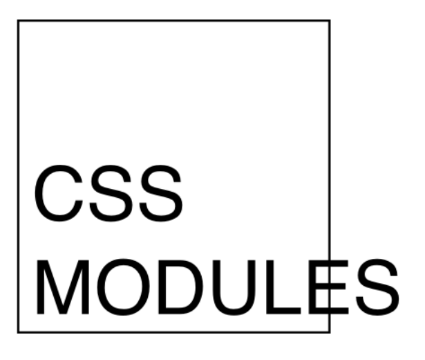
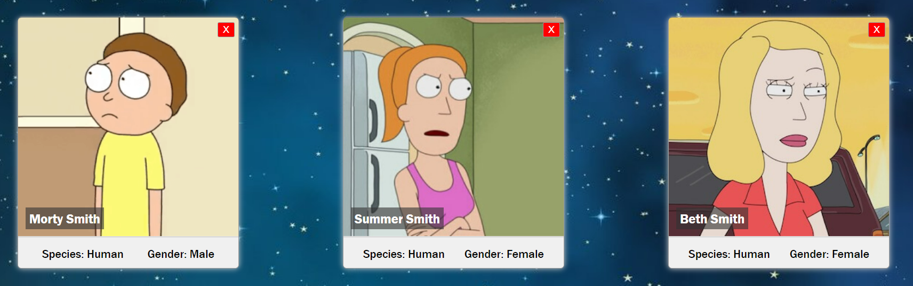

# Homework React-Estilos

## Intro

En este homework vas a utilizar CSS Modules para dar estilos a los componentes que hicimos la clase anterior.

Vas a trabajar directamente sobre la app que creamos en forma independiente con CRA (create-react-app).

### Configurando webpack

Como usamos `CRA`, no es necesario ninguna configuración para usar `css modules`. Simplemente podemos usarlo *out of the box*.

>__IMPORTANTE:__ Por la configuración del proyecto, para poder utilizar CSS Modules es necesario que la extensión de los archivos donde se definan los estilos sea `.module.css` (Por ejemplo: `Card.module.css`)

Pueden recordar cómo se usa CSS MODULES viendo los ejemplos [acá](https://css-modules.github.io/webpack-demo/).

---

## Ejercicio

Utilizando CSS Modules, tu tarea consiste en agregar estilos CSS para que los componentes queden *lindos*, puedes usar estas imágenes de referencia:

Y si te animás a ir por más...

Sé creativo/a!
