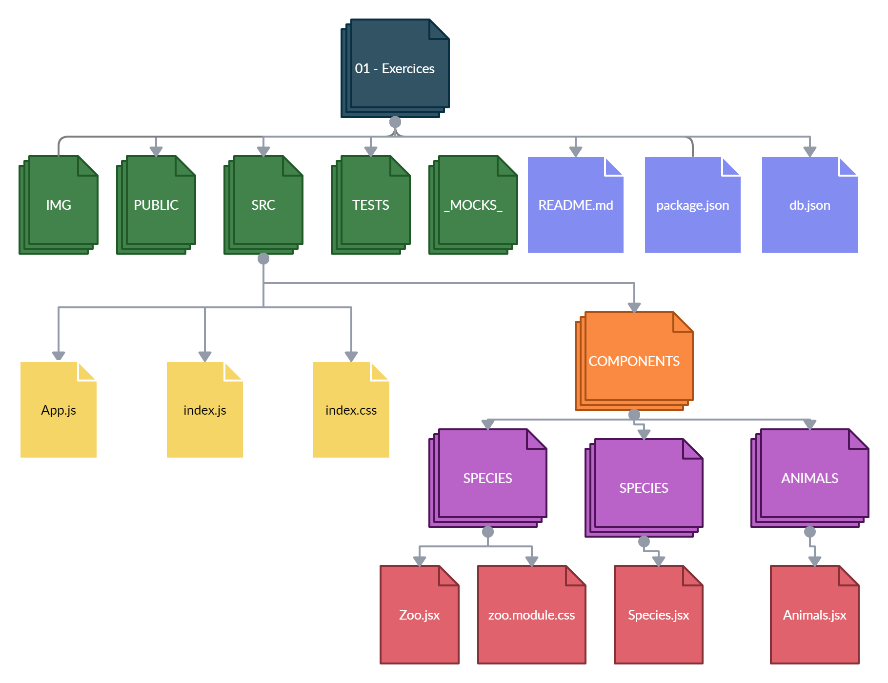
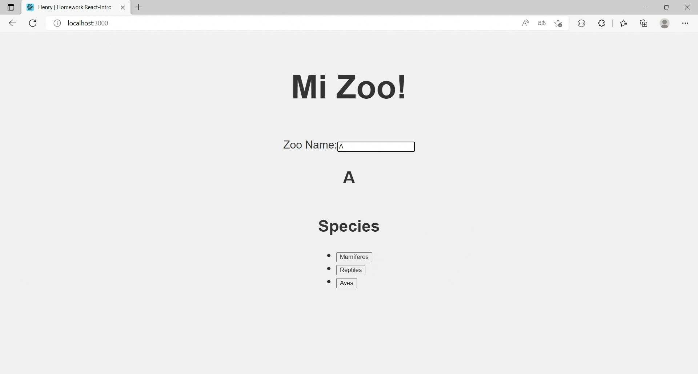
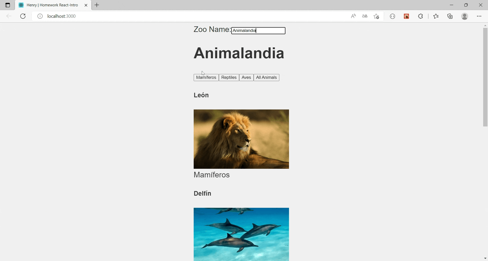

# HW 08: React-Estado-Life Cycle | Ejercicios

## **Duración estimada 🕒**

60 minutos

<br />

---

## **INTRO**

En esta actividad debes desarrollar una Zoo App utilizando componentes funcionales y componentes de clase. La misma necesita:

-  Tener un text-input en el que el usuario pueda bautizar su zoológico como desee.
-  Mostrar todos los animales que tiene el zoológico.
-  Tener botones con la funcionalidad de mostrar los animales según su especie.

<br />

---

## **Consigna de la homework**

-  Añadir un estado local en el componente **Zoo.jsx** utilizando el hook React.useState. Así tu componente será dinámico También se debe ejecutar ese estado cada vez que se renderice el componente con React.useEffect.
-  El componente **Animals.jsx** recibirá estados por props.
-  El componente **Species** también recibirá estados por props.

<br />

---

## **Pasos básicos para realizar la homework**

🔹 Para poder ejecutar los `test` de esta homework, es necesario que abramos la terminal ubicados dentro de la carpeta `01 - Exercises`.

-  Cuando te encuentres en esta carpeta, debes ejecutar el comando

```bash
npm install
```

-  Listo!! Ya puedes correr los test:

```bash
npm test
```

Si deseas correr por test, puedes utilizar:

```bash
npm run test:01
```

🔹 Para esta homework necesitarás emular peticiones a una API con el fin de consumir los datos que estén allí. Para ello debes correr el servidor **db.json**. Sin esto, no podrás visualizar el resultado esperado y no pasarán los tests. A continuación, los pasos para correr el servidor:

-  Abrir una segunda terminal.
-  En la terminal, dirígete a la carpeta que estamos trabajando.
-  Ejecuta el comando:

```bash
npm run server
```

🔹 Y por último, para poder correr la aplicación de forma local: en una **nueva terminal** sólo debes ejecutar el comando

```bash
npm start
```

-  Ingresando a <http://localhost:3000> desde el navegador, podremos ver en tiempo real el resultado de nuestro trabajo.

<br />

---

## **ESTRUCTURA**

🔹 Dentro de la carpeta `01 - Exercises`, vas a encontrar la siguiente estructura:

-  Una carpeta llamada **_mocks_**
-  Una carpeta llamada **img**
-  Una carpeta llamada **public**
-  Una carpeta llamada `src` (Es la carpeta en donde trabajaremos)
-  Una carpeta llamada **tests**
-  Un archivo **db.json**
-  Un archivo **package.json**
-  Y el archivo `README.md` que ahora mismo estás leyendo. 🧐

Además:

🔹 Dentro de la carpeta `src` encontrarás el esqueleto del proyecto React, estructurado de la siguiente manera:

-  Una carpeta llamada `components`
-  Un archivo llamado **App.js**
-  Un archivo **index.css**
-  Un archivo **index.js**

🔹 Para estos ejercicios, trabajaremos sólo dentro la carpeta `components`. Dentro de esta carpeta encontrarás:

-  Una carpeta llamada **Animals**, la cual a su vez contiene:
   -  El componente `Animals.jsx`
-  Una carpeta llamada **Species**, la cual a su vez contiene:
   -  El componente `Species.jsx`
-  Una carpeta llamada **Zoo**, la cual a su vez contiene:

   -  El componente `Zoo.jsx`
   -  La hoja de estilos **Zoo.module.css**

   

   <br />

---

## **👩‍💻 EJERCICIOS 1**

### **Crea un estado a nuestro componente funcional usando React.useState**

🔹 El componente funcional `Zoo.jsx`, es actualmente un componente sin estado.

🔹 Abre el archivo `Zoo.jsx`. Dentro de él encontrarás:

-  El import de:

   -  La librería **React**
   -  El componente **Animals**
   -  El componente **Species**
   -  El archivo **Zoo.module.css**

-  La función `Zoo` que renderiza:

   -  Un div.
   -  Dentro de este div, se renderiza una etiqueta h1.

🔹 Lo que hay que hacer:

1. Utiliza el hook React.useState devolviendo el array con la variable llamada `zoo` y método llamado `setZoo`, cuyo valor inicial de éste sea un objeto con las siguientes propiedades:

-  `zooName` en el que su valor sea un string vacío.
-  `animals` en el que su valor sea un array vacío.
-  `species` en el que su valor sea un array vacío.
-  `allAnimals` en el que su valor sea un array vacío.

Por ejemplo:

```js
const [example, setExample] = React.useState({
   example1: '',
   example2: [],
   example3: [],
});
```

> **Nota**: Para que corran los test, el hook debe ser utilizado de esta manera: **React.useState()**. No debe utilizarse como **useState()**. 💡

2. Renderiza una etiqueta label arriba de la etiqueta h1 que contenga el texto `Zoo Name:`.
3. Renderiza una etiqueta input debajo de la etiqueta label y arriba de la etiqueta h1.
4. En la etiqueta h1, renderiza el estado **_zoo.zooName_**
5. A la etiqueta input asígnale el atributo `value` con el estado **_zoo.zooName_**.
6. Crea una función llamada `handleInputChange`, que reciba un **evento** como parámetro.
7. Dentro de la función **_handleInputChange_**, setea del estado zoo, la propiedad **zooName**, capturando el valor del input.
8. A la etiqueta input, asígnale el atributo `onChange`, que sea igual a la función **_handleInputChange_** creada anteriormente.

🔹 Resultado esperado:

<p align="center"></p>

<br />

---

## **👩‍💻 EJERCICIOS 2**

### **Crea el hook React.useEffect en nuestro componente funcional**

🔹 Continúa trabajando en el componente **Zoo.jsx**.

🔹 Lo que hay que hacer:

1. Utiliza el hook React.useEffect.

> **Hint**: No olvides que el hook ReactuseEffect recibe dos parámetros. 💡

> **Nota**: Para que corran los test, el hook debe ser utilizado de esta manera: **React.useEffect()**. No debe utilizarse como **useEffect()**. 💡

2. Dentro del hook, usa fetch para hacer una petición al servidor **db.json** a través de la url `'http://localhost:3001/zoo'`. Así obtendrás el objeto **zoo** con los datos de los animales. Para utilizar fetch, es necesario usar promesas. Como aún no las has visto, tienes este snippet para que copies y pegues dentro del hook React.useEffect:

```js
fetch('http://localhost:3001/zoo')
   .then((res) => res.json())
   .then((data) =>
      setZoo({
         ...zoo,
         animals: data.animals,
         species: data.species,
         allAnimals: data.animals,
      })
   )
   .catch((error) => console.log(error));
```

> **Nota**: si tienes conocimiento base en promesas y deseas hacerlo de otra manera, puedes hacer la llamada utilizando `axios` para traer los datos. En caso que no, te invitamos a que veas el código y analices qué puede estar pasando.💡

3. Crea una función llamada `handleSpecies`, que reciba un **evento** como parámetro.
4. Crea una función llamada `handleAllSpecies`.
5. Dentro de la etiqueta div y por debajo de lo que ya existe allí, renderiza el componente Species y el componente Animals, haciendo lo siguiente:
   -  Pasa del estado **zoo**, únicamente la propiedad `species` (utilizando dicho nombre) y las funciones `handleSpecies`, `handleAllSpecies` como props al renderizar el componente **_Species_**.
   -  Pasa del estado **zoo**, únicamente la propiedad `animals` (utilizando dicho nombre) como props al renderizar el componente **_Animals_**.

<br />

---

## **👩‍💻 EJERCICIOS 3**

### **Recibiendo props en nuestro componente de clases Animals**

🔹 Ahora trabajaremos en el componente **Animals.jsx**.

🔹 Abre el archivo `Animals.jsx`, dentro de él encontrarás:

-  El import de la librería **React**

-  La función de clase `Animals` que renderiza un div.

🔹 Lo que hay que hacer:

1. Dentro del div, mapea y renderiza las props `animals` de acuerdo a lo que necesitemos:
   -  Por cada animal, debemos renderizar un div con lo siguiente:
      -  Una etiqueta **h5** con el nombre del animal.
      -  Una etiqueta **img** con los atributos:
         -  **_src_** asignando como valor la imagen del animal.
         -  **_alt_** asignando como valor el nombre del animal.
         -  **_width_** con un valor de 300px (para darle un tamaño apropiado a la imagen).
      -  Una etiqueta **span** con la especie del animal.

> Tips:
>
> -  En el arhivo `db.json` puedes ver las propiedades de cada animal.
> -  Para recorrer el arreglo y retornar elementos de acuerdo a su contenido, puedes usar el método `map`, recuerda que el map recibe dos parámetros, uno de ellos es la key.

🔹 Resultado esperado:

<p align="center"></p>

<br />

---

## **👩‍💻 EJERCICIOS 4**

### **Recibiendo props en nuestro componente funcional Species**

🔹 Ahora trabajaremos en el componente **Species.jsx**.

🔹 Abre el archivo `Species.jsx`. Dentro de él encontrarás:

-  El import de la librería **React**

-  La función `Species` que renderiza un div.

🔹 Lo que hay que hacer:

1. Renderizar una etiqueta **h2** con el texto `Species`.
2. El componente recibe props, y dentro del div, mapea y renderiza las especies que vienen por props en una etiqueta **button**.
3. En el children del button renderiza las especies.
4. Agrega a la etiqueta button los siguientes atributos:
   -  **_key_**
   -  El evento **_onClick_**, asignándole la función `props.handleSpecies` que también se recibe por props.
   -  Un **_value_** asignándole la especie.
5. Fuera del map, agrega una segunda etiqueta de botón con el evento **_onClick_** que llame a la función `props.handleAllSpecies` y que su children sea "All Animals".

(Por ahora nuestros botones no hacen nada).

> Tip:
>
> -  Para recorrer el arreglo y retornar elementos de acuerdo a su contenido, puedes usar el método `map`, recuerda que éste recibe dos parámetros, uno de ellos es la key.

🔹 Resultado esperado:

<p align="center"></p>

<br />

---

## **👩‍💻 EJERCICIOS 5**

### **...Estamos llegando a la última parte de la homework ⭐**

Vamos a dar la funcionalidad correspondiente a la app para que cuando el usuario haga click en una de las especies nos renderice los animales relacionados a esa especie y cuando haga click en el botón "All Animals" renderice nuevamente todos los animales.

🔹 Lo que hay que hacer:

1. Volvamos al componente Zoo
2. Dentro de la función `handleSpecies`, setea el estado **zoo**, modificando la propiedad animals, implementando la lógica para filtrar los animales según su especie.
3. Dentro de la función `handleAllSpecies`, setea dentro del estado **zoo**, modificando la propiedad animals con el valor de la propiedad `allAnimals`.

> Tip:
>
> -  Para recorrer el arreglo y retornar sólo los elementos necesarios, puedes usar el método `filter`. **Nota**: al hacer filter del estado zoo.animals, los datos que no coincidan con el filtrado, se perderían; puedes utilizar la propiedad "zoo.allAnimals" para mantener una copia de ese arreglo.

> Para esta instancia deben pasar todos los tests. ✅ 🏆

🔹 Resultado esperado:

<p align="center"></p>

<br />

---

## **🧠 Recuerda que...**

-  Los hooks son funciones especiales que nos permiten acceder a las funcionalidades de React.
-  El hook React.useState se desestructura en un array. La primera variable nos permite acceder al valor de ese estado. La segunda variable es un método para actualizar ese estado.
-  Las variables de estado no tienen que inicializarse siempre en un objeto, puede ser en un array, string, número, boolean, etc.
-  Puedes usar en el componente los React.useState que desees.😃
-  El hook useEffect recibe dos parámetros: la función que React ejecutará en alguna etapa del ciclo de vida del componente (monta, actualiza, desmonta), y un array de dependencias como opcional.
-  Puedes utilizar más de un useEffect en el mismo componente. 😃

<br />

---

## **🔎 Recursos adicionales**

-  Documentación [**Using the State Hook**](https://reactjs.org/docs/hooks-state.html)
-  Documentación [**Using the Effect Hook**](https://reactjs.org/docs/hooks-effect.html)

<br />

---

Listo!! Aprendiste cómo funcionan los componentes de estado y sus ciclos de vida!! ✨🚀

Dirígete a la carpeta 📂 [**"02 - Integration"**](../02%20-%20Integration/README.md) y continúa desarrollando la app de Rick & Morty 🤩

---
