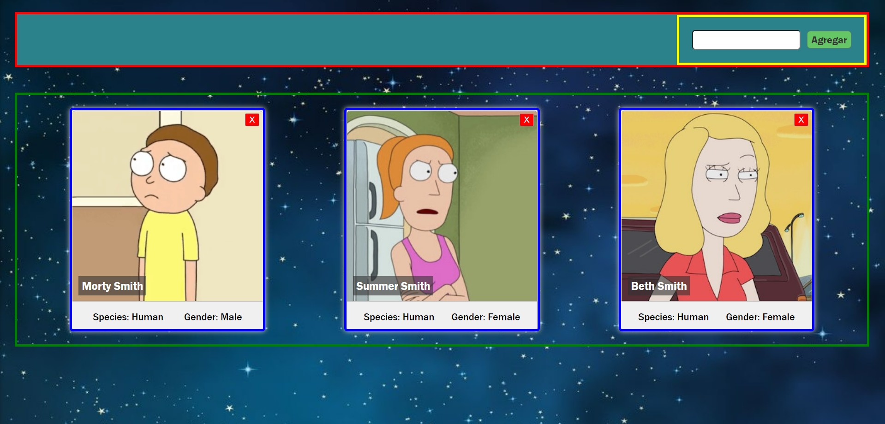

# HW 02 - React-Estado-LifeCycle | Integración

## Duración estimada 🕒

x minutos

---

## Rick & Morty App

### Intro

Hasta el momento, en nuestra Rick & Morty App tenemos estos 3 Componentes:

* Card.jsx
* Cards.jsx
* SearchBar.jsx

Adicionalmente, vamos a crear otro componente denominado `Nav` que va a ser nuestra barra superior de navegación, en la cual debemos incluir el componente `SearchBar`.

También vamos a reestructurar nuestra vista ***"Home"***, que no es más que nuestro archivo `App.js` para darle una forma más ordenada.


---

## Comencemos

En el archivo `App.js` ya tenemos importados y estamos renderizando los 3 componentes que vamos a codear. Revisa el código, verás que le estamos pasando props a estos componentes.

---

### 👩‍💻 Ejercicio 1 
### Crear Nav

1. Crear el componente `Nav`.
2. Escribir el código correspondiente en `components/Nav.jsx`. 

> **Hint**: Este componente debe incluir el componente `SearchBar`.

---

### 👩‍💻 Ejercicio 2

### Reestructurar Home


1. Veamos primero una imagen del resultado final y pensemos la estructura general:



>* **Recuadro rojo**: Nav
>* **Recuadro amarillo**: SearchBar
>* **Recuadro verde**: Cards
>* **Recuadro azul**: Card

2. Ahora vamos a modificar el contenido del archivo `App.js`:

    * En `App` sólo vamos a renderizar los componentes `Cards` y `Nav`.
    * Ya no vamos a renderizar la primera `Card` "suelta" que pusimos en la primera clase, ya que el mismo `Cards` incluye varias `Card`.
    *  Lo mismo sucede con `SearchBar`, no lo vamos a renderizar más directamente en App, debido a que ya se encuentra dentro de `Nav`.

3. Importar y renderizar los componentes que vamos a utilizar.
4. Aplicar estilos básicos al componente ***Nav***.

🔹 Resultado esperado:


---

### 👩‍💻 Ejercicio 3 

### Implementar un estado

Necesitamos mantener actualizado el listado de personajes a mostrar, para ello debemos crear un estado al componente `App.js` donde tengamos el array de personajes.

1. Borra el import que traes de data.js (Ya no vamos a usar más los datos de este archivo).
2. Importa el hook useState.
3. Crea un estado `characters` donde tengamos el array de personajes.

---

### 👩‍💻 Ejercicio 4 

### Función para agregar personajes

Ahora debemos crear una función para agregar nuevos personajes a nuestro estado `characters` y se la pasaremos al `SearchBar` mediante el `Nav`.

> **Hint**: Como aún no hemos hecho el llamado a la API para obtener los datos del personaje, agregamos uno por default para ver que esté funcionando:

```jsx
const example = {
      name: 'Morty Smith',
      species: 'Human',
      gender: 'Male',
      image: 'https://rickandmortyapi.com/api/character/avatar/2.jpeg'
    }
```
---

### 👩‍💻 Ejercicio 5  

### Le pasamos la función a Nav

Nuestra función recién creada, que modifica el estado `characters` se la pasamos a `Nav`.

---

### 👩‍💻 Ejercicio 6 

### Seguimos pasando la función para que llegue a su destino

Quien finalmente debe ejecutar la función `onSearch` no es el `Nav` sino el `SearchBar`, por lo que debemos hacerle llegar dicha función.

---

### 👩‍💻 Ejercicio 7

### Analizando función onSearch

En la homework anterior **06-React-Intro, 02 - Integration**, ya habíamos creado el componente `SearchBar` que recibía la función como parámetro y la ejecutaba cuando se hacía un `submit` del form.

En este punto la función ya debería ejecutarse, cada vez que le demos click al botón `Agregar`, un nuevo personaje se añade a nuestro estado `characters` y por cada uno de ellos nuestro componente `Cards` renderiza una `Card`.

Si observamos el código anterior estamos llamando a la función `onSearch` sin pasarle ningún parámetro, pero quisiéramos que ese parámetro dependa del input ingresado por el usuario.


---

### 👩‍💻 Ejercicio 8

### Pasándole parámetros a la función

1. Modifica el componente `SearchBar` para que mantenga un **estado** interno del nombre del personaje (`character`) escrito por el usuario y que cuando haya un cambio en el input, lo detecte mediante el listener `onChange` y actualice dicho estado.

2. Adicionalmente, pasar dicho estado `character` como parámetro de la función `onSearch` cuando la llamamos en el `submit`; para que utilice el estado, que contiene lo que ingresó el usuario y éste valor llegue así a la función ***onSearch*** que tenemos en **App.js**.

---

### 👩‍💻 Ejercicio 9

### Buscando datos reales

1. Ahora debemos modificar la función `onSearch` para que obtenga los datos necesarios desde la API de [Rick&Morty](https://rickandmortyapi.com). Para ello vamos a utilizar `fetch` para hacer la llamada y obtener el resultado. Por el momento sólo vamos a obtener los personajes por ID, ya que si los buscamos por nombre hay demasiados resultados debido a que los mismos se repiten bastante.

2. Mostrar un mensaje en caso de que el personaje no exista.

> **Hint**:Como aún no has visto promesas, tienes este snippet para que copies y pegues dentro de la función ***onSearch***:

```js
function onSearch (character) {
    fetch(`https://rickandmortyapi.com/api/character/${character}`)
      .then(response => response.json())
      .then(data => {
        if (data.name) {
          setCharacters(oldChars => [...oldChars, data])
        } else {
          window.alert('No hay personajes con ese ID')
        }
      })
  }
```

---

### 👩‍💻 Ejercicio 10

### Cerrar cards

Por último, recordemos que en la homework anterior **06-React-Intro, 02 - Integration** habíamos creado el componente `Card` para que reciba una función como parámetro. Ésta va a ser la encargada de eliminar esa card al momento de hacer click en el botón `X`.

Para ello es necesario definir dicha función `onClose` en **App.js**, para que a partir del id recibido, elimina dicho personaje del array de personajes del ***estado***.

> **Hint**: Puedes utilizar el método `filter`.

---

🔹 Resultado esperado:


Listo! tu app es ahora dinámica e interactiva!! 👏🏼🚀

---

## 👩‍💻 Ejercicio Extra

* Controlar que no se puedan agregar personajes repetidos.
* Agregar un botón en la navbar que agregue un personaje random (Hint: hay 826 personajes en total).


