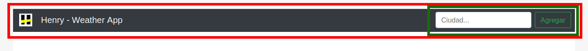
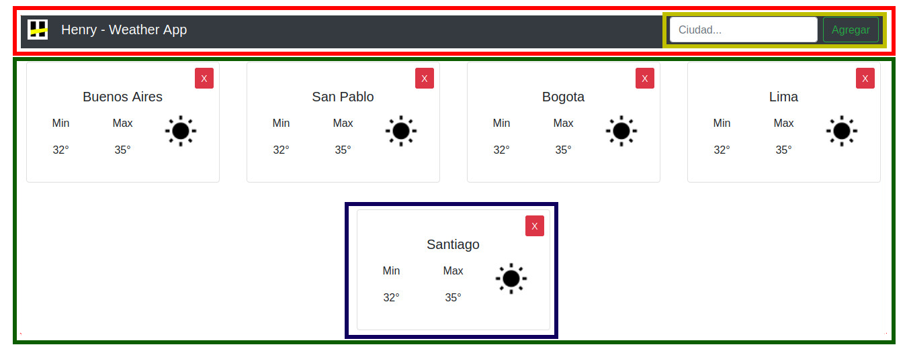
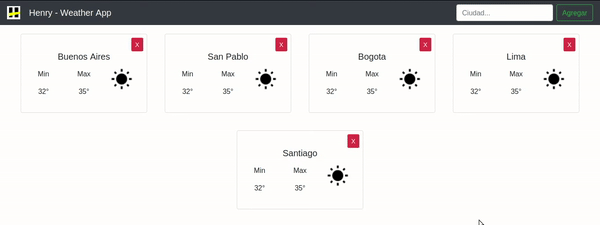
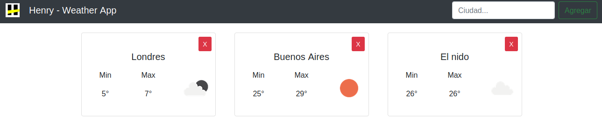

## Henry Weather

### Instrucciones para correr el proyecto

Desde la carpeta "homework" se pueden ejecutar los siguientes comandos:

1. `npm install`: Instala todas las dependencias necesarias para correr el proyecto correctamente. [Es necesario correrlo sólo la primera vez]

2. `npm start`: Comienza a correr la aplicación de forma local por lo que se puede ver desde el navegador accediendo a http://localhost:3000

No es necesario volver a correr el proyecto cada vez que se realice un cambio sino que se verá automáticamente reflejando en el navegador.

> Hay veces que por problemas de configuración los cambios no se ven automáticamente reflejados en el navegador por lo que si te ocurre esto la opción rápida sería parar la ejecición del proyecto (Ctrl + C) y volver a ejecutar `npm start`. De todas formas si te ocurre esto contactate con tu PM.

### Ejercitación

1. Ya se encuentran copiados los componentes creados en el ejercicio anterior dentro de la carpeta `components`. En el caso de que quieran utilizar los que hicieron ustedes, copiar todos los archivos que se encuentren en la carpeta `components` del ejercicio `07-React-Estilos` a la carpeta `components` pero del ejercicio `08-React-Estado-LifeCycle` sobreescribiendo los que ya se encuentran allí.

  * Card.jsx
  * Cards.jsx
  * SearchBar.jsx

2. Adicionalmente a los componentes que ya teníamos vamos a tener que crear otro denominado `Nav` que va a ser nuestra barra superior de navegación en la cual debemos incluir el componente `SearchBar`. Escribir el código correspondiente en `components/Nav.jsx`. Pueden utilizar como base los [navbars ya definidos de Bootstrap](https://getbootstrap.com/docs/4.4/components/navbar/). El resultado debería ser similar a lo siguiente:

<p align="center">
  
</p>

* __Recuadro rojo__: Nav
* __Recuadro verde__: SearchBar

Ahora que ya tenemos cada una de las partes de nuestra aplicación procedamos a unirlas. Para ello veamos una imagen del resultado final y pensemos la estrucutra general:

<p align="center">
  
</p>

  * __Recuadro rojo__: Nav
  * __Recuadro amarillo__: SearchBar
  * __Recuadro verde__: Cards
  * __Recuadro azul__: Card

3. Dentro del archivo `App.js` cambiar el contenido que se esta renderizando actualmente `<h1>Título</h1>` por los componentes que deberíamos  mostrar. Recordar que cada una de las tarjetas del clima (`Card`) están incluidas dentro de un componente superior (`Cards`) y que el `SearchBar` se encuentra dentro del `Nav` por lo que solo deberíamos agregar acá los componentes `Nav` y `Cards`.

  * Importar los componentes que vamos a utilizar
  * Agregarlos dentro del método render

```js
// App.js
...

//Importar
import Nav from './components/Nav.jsx';
import Cards from './components/Cards.jsx';

...
      //Renderizar componentes
      <div className="App">
        <Nav />
        <Cards />
      </div>
...

```

Inicialmente si nuestro componente Cards no está recibiendo datos de ciudades la aplicación se vería de la siguiente forma (Pueden si quieren al igual que realizamos en el ejercicio anterior importar los datos de ejemplo `data.js` y pasárselos como parámetro para verificar su funcionamiento):

<p align="center">
  
</p>

*Observen que dentro del componente Cards se está verificando si está recibiendo las cities como prop o no, en el caso de que no las reciba devuelve un mensaje avisando para evitar que surja un error al intentar realizar el map sobre el array vacio*

4. Utilizar el archivo `App.js` para mantener actualizado el listado de ciudades a mostrar. Para ello debemos crearle un estado a este componente donde tengamos el array de ciudades:

```js
// App.js
...

//Modificar esta línea para poder manejar el estado
import React, { useState } from 'react'; //Se agregó el { useState }

...

function App() {
  const [cities, setCities] = useState([]);

  ...

}

export default App;
```

5. Ahora debemos crear una función para agregar nuevas ciudades a nuestro estado `cities` y se la pasaremos al `SearchBar` mediante el `Nav`.

```js
// App.js

...

function App() {

  ...

  function onSearch(ciudad) {
    //Acá habría que hacer el llamado a la API para obtener los datos de la ciudad
    //pero de momento agregaremos una ciudad por default para ver que funcione

    const ciudadEjemplo = {
      min: 32,
      max: 35,
      img: "03n",
      id: 2172797,
      wind: 3.6,
      temp: 300.15,
      name: "Cairns",
      weather: "Clouds",
      clouds: 40,
      latitud: -16.92,
      longitud: 145.77
    };
    setCities(oldCities => [...oldCities, ciudadEjemplo]);
  }

}

export default App;
```

6. Pasarle la función recién creada al `Nav`.

```js
// App.js
...
        <Nav onSearch={onSearch}/>
...

```

7. Quien finalmente debe ejecutar la función `onSearch` no es el `Nav` sino el `SearchBar` por lo que debemos hacerle llegar dicha función.

```js
// Nav.jsx
...
        <SearchBar onSearch={onSearch}/>
...

```

8. En este punto ya la función debería ejecutarse ya que en el ejercicio anterior ya habíamos creado el componente `SearchBar` que recibía la función como parámetro y la ejecutaba cuando se hacía un `submit` del form.

```js
//SearchBar.jsx

export default function SearchBar({onSearch}) {
  return (
    <form onSubmit={(e) => {
      e.preventDefault();
      onSearch("Cairns");
    }}>
      <input
        type="text"
        placeholder="Ciudad..."
      />
      <input type="submit" value="Agregar" />
    </form>
  );
}
```

Si observamos el código anterior estamos llamando a la función `onSearch` con un parámetro ya fijo pero quisiéramos que ese parámetro dependa del input ingresado por el usuario.

9. Modificar el componente `SearchBar` para que mantenga un estado interno del nombre de la ciudad (`city`) escrita por el usuario y que cuando haya un cambio en el input lo detecte mediante el listener `onChange` y actualice dicho estado. Adicionalmente cambiar el parámetro de la funcion `onSearch` para que utilice el estado `city` en vez del valor fijo que tenía hasta ahora (Si ya habían realizado esto en el ejercicio anterior, saltear este paso)

Llegado a este punto cada vez que le den click al botón de `Agregar` se debe incluir una nueva tarjeta con los datos que seteamos para la ciudad de `Cairns`

10. Modificar la función `onSearch` para que obtenga los datos necesarios desde la API de [openweather](https://openweathermap.org/current). Para ello pueden utilizar `fetch` para hacer la llamada y obtener el resultado. En el caso de que la ciudad no exista deberíamos mostrar un mensaje indicándolo.

__IMPORTANTE__: Para poder realizar las llamadas a la API es necesario contar con una apiKey  que como verán en el código debajo debe ser incluida dentro de la URL. La misma la podemos obtener creando una cuenta en la paǵina de [openweather](https://openweathermap.org/current). Sino consultar con sus PMs si tienen ya una apiKey para darles y que puedan evitar realizar este paso.

*Pueden utilizar sino la siguiente apiKey: '4ae2636d8dfbdc3044bede63951a019b'*

```js
// App.js

  ...

  function onSearch(ciudad) {
    fetch(`http://api.openweathermap.org/data/2.5/weather?q=${ciudad}&appid=${apiKey}&units=metric`)
      .then(r => r.json())
      .then((recurso) => {
        if(recurso.main !== undefined){
          const ciudad = {
            min: Math.round(recurso.main.temp_min),
            max: Math.round(recurso.main.temp_max),
            img: recurso.weather[0].icon,
            id: recurso.id,
            wind: recurso.wind.speed,
            temp: recurso.main.temp,
            name: recurso.name,
            weather: recurso.weather[0].main,
            clouds: recurso.clouds.all,
            latitud: recurso.coord.lat,
            longitud: recurso.coord.lon
          };
          setCities(oldCities => [...oldCities, ciudad]);
        } else {
          alert("Ciudad no encontrada");
        }
      });

    }

...

```

11. Por último en el ejercicio anterior habíamos creado el componente `Card` para que reciba una función como parámetro. Esta va a ser la encargada de eliminarla al momento de hacer click en el botón `X`. Para ello es necesario definir dicha función en `App.js` para que a partir del id recibido, elimina dicha cudad del array de ciudades del estado.

```js
// App.js

  ...

  function App() {

    ...

    function onClose(id) {
      setCities(oldCities => oldCities.filter(c => c.id != id));
    }

    ...

```
Muestra final de la aplicación funcionando:

<p align="center">
  
</p>

<p align="center">
  
</p>


