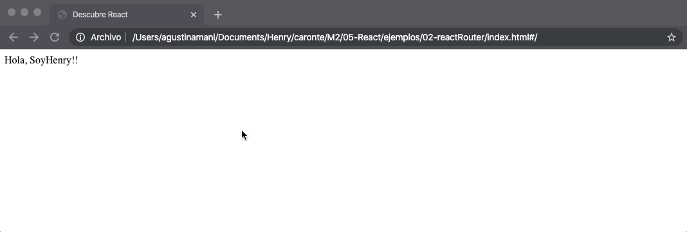
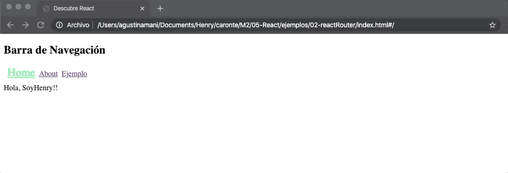

# Henry

<table width="100%" style='table-layout:fixed;'>
  <tr>
	  <td>
	  	<a href="https://airtable.com/shrHsDa2eamWqLAre?prefill_clase=09-React-Routing">
			
			<br>
			Hacé click acá para dejar tu feedback sobre esta clase.
	  	</a>
	  </td>
              <td>
      <a href="https://quiz.soyhenry.com/evaluation/new/607ee76b56b4056ff03288da">
        
        <br>
        Hacé click acá completar el quiz teórico de esta lecture.
      </a>
   </td>
  </tr>
</table>

# Front-End Routing

Vamos a ver que muchísimos proyectos de _React_ están construidos comos __SPA__ (Single Page Applications), es decir que sin recargar una página se van mostrando algunos _Containers_ u otros según donde vaya navegando el usuario. Gracias a que tenemos todo encapsulado en _Componentes_ pensar nuestra _app_ como __SPA__ no puede ser muy complejo, lo que sí puede serlo es el _ruteo_ interno en el _front-end_, es decir, el trabajo de __mapear__ cada _link_ con algún _Componente_. Por suerte no estamos solos, existen varias librerías en _npm_ listas para ayudarnos con esto. Nosotros vamos a usar una llamada _react-router_.

## React Router

Según su descripción en su [repo](https://github.com/ReactTraining/react-router), __react-router__ sirve para mantener sincronizados tu _UI_ con la _url_ de una forma _declarativa_. 

Nosotros utilizaremos react-router-dom, que contiene los componentes basicos de `react-router` mas componentes extras que iremos utilizando. Básicamente, lo que nos da `react-router-dom` son una serie de  _Componentes_, los cuales van a recibir ciertas _props_ que le van cambiar el comportamiento. La idea entonces será tener un _Componente_ principal que se va a cargar en nuestra página ( la única que vamos a tener ), y este se encargará de llamar a nuestro __Componentes__ que querramos mostrar según a donde navegue el usuario.
Por ejemplo:

```javascript
ReactDOM.render((
  <HashRouter>
    <Route path="/" component={Home} />
  </HashRouter>
), document.getElementById('root'));
```

### Empezando con react-router-dom

Como siempre, vamos a empezar por instalar `react-router-dom` en nuestro proyecto con `$ npm install --save react-router-dom`.

Luego, vamos a _importar_ los _Componentes_ que necesitamos:

```javascript
import { HashRouter, Route } from 'react-router-dom'; 

ReactDOM.render((
  <HashRouter>
    <Route path="/" component={App}/>
  </HashRouter>
), document.getElementById('app'))
```

> En una SPA no vamos a poder usar la barra de URL _out of the box_ para manejarnos entre nuestras URLs. Por eso exiten componentes como  _HashRouter_ que es un Router que usa partes de los hashes de la URL para mantener en sincronia nuestra UI con la URL y _BrowserRouter_ que usa la API de HTML5 para mantener la sincronia con la URL. El componente `BrowserRouter` es más utilizado en servidores que manejan peticiones dinámicas, mientras que `HashRouter` se utiliza en sitios web estáticos. En este caso utilizaremos `HashRouter`.

Para ver cómo funciona, vamos a usar los _Componentes_ que habiamos creado en el ejemplo anterior: `MostrarLista` , `ContenedorAmigos`, y `HelloWorld`. Vamos a crear una _SPA_ con dos __rutas__, una para `MostrarLista` y otra para `HelloWorld`.

Para hacerlo, primero vamos a importar todos los _Componentes_ y librerías necesarias y luego usar los Componentes de _react-router-dom_ para definir nuestras rutas de la siguiente manera:

```javascript
import MostrarLista from './MostrarLista.js';
import HelloWorld from 'HelloWorld.js';

// ReactDOM.render(<ContenedorAmigos>Hola!</ContenedorAmigos>, document.getElementById('app'));

ReactDOM.render((
  <HashRouter>
    <Route path="/lista" component={ContenedorAmigos}/>
    <Route exact path="/" component={HelloWord}/>
  </HashRouter>
), document.getElementById('app'));
```

Primero vemos que vamos a envolver todo en un Componente llamador `BrowserRouter`.
Dentro de `BrowserRouter`, vamos a agregar nuestras rutas. En este caso agregamos dos, usando `<Route>`. A este Componente hay que pasarle dos propiedades:
* _path_: Es el path de la __url__ que va a activar esta ruta.
* _component_: Es el componente que se va a cargar cuando ingresemos a la ruta definida en el _path_.
* _exact_: Agregamos esta keyword para que matchee exactamente con el path que le pasamos. Este parametro entra en juego cuando tenemos path anidados.



Ahora, si probamos este ejemplo (siguiendo los pasos mencionados anteriormente sobre como usar _webpack_), vamos a ver en el browser que se carga el Componente que declaramos en la ruta `/`, y si escribimos `/lista` en la URL, vemos que automáticamente se carga el componente declarado en la ruta `/lista`.

> Si son observadores se habrán dado cuenta del __#__ en la barra de direcciones después del `index.html`, esto se debe a que estamos usando el middleware `hashHistory` para mapear URLs, más adelante vamos a ver otras formas.

## Links

Bien, ahora lo que necesitamos es crear Links para navegar entre rutas. Podríamos usar el tag `<a>` y en el `href` agregar el `/`, por dos razones simples no vamos a usar este método y sí vamos a usar un nuevo Componente de `react-router-dom` llamado `Link`. La primera razón es que si por alguna razón dejamos de usar `BrowserRouter`, probablemente (no es seguro) nuestros links dejarían de funcionar, la segunda es que los `Links` de `react-router-dom` no producen un 'refresh' en nuestra pagina como lo hacen los hag <a>

Como siempre, primero vamos a tener que importar el Componente `Link` de `react-router-dom`. Luego, lo vamos a utilizar de manera muy similar a `<a>` sólo que en vez de `href` vamos a pasarle la _propiedad_ `to`, y en ella indicarle a que _path_ nos debería llevar. Por ejemplo, agreguemos un Link en el Componente `Home` del ejemplo anterior (también agregamos un link `<a>` para ver qué sucede):

```javascript
import React from 'react';
import { Link } from 'react-router-dom';

function Home(){
    return (
      <div>
        Hola, Soy Henry!!
        <a href='#/lista'>Link normal a Lista</a>
        <Link to='/lista'>Link de react-router a Lista</Link>
        <Link to='/'>Link de react-router a Home</Link>
      </div>
    )
  }
});
```

En el Componente `ContenedorAmigos` también voy a agregar un Link, para poder navegar ida y vuelta entre los dos _paths_.

> También agregamos un Link a la misma página como si fuera una barra de navegación.

Existe tambien una nueva version de los <Link> que son los <NavLink> que nos ayuda a agregar estilos a nuestros links que matcheen con nuestra URL actual.

Tambien veamos como usar el feature de mostrar distinto los `Links` de páginas activas. Por empezar definamos una clase CSS con algún color llamativo en nuestro archivo `index.html` :

```html
<style>
      .active {
        color: SpringGreen;
        font-size: 24px;
      }
</style>
```

Ahora en los `NavLinks` vamos a agregar la propiedad `activeClassName` y pasarle el nombre de la clase que queremos que tenga el `Link` cunado coincidan la url que tiene en su propiedad `to` con la url en la que estamos. Esto nos va a servir para, por ejemplo, tener un sólo Componente que sea una barra de navegación y cambiar el estilo del link cuando el usuario haya navegado a la página correspondiente.

```html
    <a href='#/lista'>Link normal a Lista</a>
    <NavLink to='/lista' activeClassName= 'active'>Link de react-router a Lista</NavLink>
    <NavLink to='/' activeClassName= 'active'>Link de react-router a Home</NavLink>
```

> Por ahora no estamos realizando las mejores prácticas en términos de reutilizar Componentes, por lo tanto vamos a escribir la propiedad en todos los Links.

Veamos el resultado:


Con esto vamos a poder navegar entre páginas de nuestra SPA, y además ya tenemos resuelto el tema de mantener los estilos de los Links de páginas activas!

## Reutilizando Componentes con React-Router-Dom

Recién vimos en el ejemplo que usamos la misma barra de navegación en varios Componentes. Pero en este caso no _reutilizamos_ código ya que tuvimos que escribir el código de los `Links` en cada Componente.

Veamos como podríamos hacer para tener siempre un Componente que se cargué siempre (con cosas que queremos mostrar siempre como Navbars, Footers, etc...), y dentro de este que se carguen distintos Componentes según la página a la que naveguemos.

Lo primero que necesitamos es tener algo que queremos que se repita, en este caso una barra de navegación con algunos Links:

```javascript
import React from 'react';
import { NavLink } from 'react-router-dom';

export default function NavBar() {
    return (
      <div>
        <h2>Barra de Navegación</h2>
        <NavLink to="/" activeClassName="active" >Home</NavLink>
        <NavLink to="/about" activeClassName="active" >About</NavLink>
        <NavLink to="/ejemplo" activeClassName="active">Ejemplo</NavLink>
      </div>
    );
  }
});
```

Ahora que tenemos nuestra NavBar, vamos a necesitar un Componente que se cargue siempre, y que dentro de él esten la Navbar (o todo lo que querramos que se renderize siempre) y también que _llame_ a los Componentes que corresponden según la url.
Para entender esto, mejor empezemos viendo cómo serán las rutas de `react-router-dom` para diagramar lo que queremos hacer:

```javascript
ReactDOM.render(
  <HashRouter>
    <NavBar />
    <Switch>
      <Route path="/about" component={About}/>
      <Route path="/ejemplo" component={Ejemplo}/>
      <Route exact path="/" component={Home}/>
    </Switch>
  </HashRouter>,
  document.getElementById('app')
);
```
Ahora introduciomos otro componente de 'react-router-dom', <Switch>, este es único en el sentido de que representa una ruta exclusivamente. Por ej, si estamos en /about, <Switch> comenzará a buscar una <Route> coincidente. <Route path = "/about" /> coincidirá y <Switch> dejará de buscar coincidencias y mostrará <About>. Básicamente lo que va a ocurrir, es que cuando se cargué la página, se va a invocar al Componente raíz que matchee con la ruta ( en este ejemplo: `/` ), y si cambiamos de ruta por ejemplo /ejemplos, <Switch> empezara a buscar y en el primer match renderizara la ruta, en este caso el componente <Ejemplo>. Ponemos el path "/" ya que siempre sera match entonces sera nuestra ruta por default.
 Afuera de nuestro `Switch` pondremos nuestro componente <NavBar />, que no tendra ningun path para nuestra url, y renderizara siempra. Este sera nuestro componente que nos permitira movernos a las rutas que tengamos en nuestro `Switch`.

Como vemos, importamos los Componentes como siempre y en el método render retornamos un `div` ( JSX sólo nos deja retornar un único elemento que envuelta todo), que tiene adentro a nuestro `Nav` y además usamos la referencia `this.props.children` para retornar el Componente que nos haya pasado `react-router-dom` según la ruta donde haya navegado el usuario.

En la siguiente imagen, digramamos que sería cada Componente:


El componente violeta llamado _Componentes_ va a ser el que se renderizé a través nuestras rutas.

Veamos nuestro código en funcionamiento:



Bien, vemos que renderiza bien la barra de navegación en todas las páginas, pero está pasando algo raro ya que el `NavLink` al home ( '/' ) está siempre como activo. Esto se debe a que la ruta de ese link matchea siempre con la ruta de la ruta _raíz_. Para resolver este problema debemos agregar lo siguiente:

```javascript
  <div>
    <h2>Barra de Navegación</h2>
    <NavLink exact to="/" activeClassName="active" >Home</NavLink>
    <NavLink to="/about" activeClassName="active" >Componente2</NavLink>
    <NavLink to="/ejemplo" activeClassName="active">Componente3</NavLink>
  </div>
```
El parametro `exact` cuando lo pasamos nuestra `activeClassName` solo se aplicará si la ubicación coincida exactamente.


