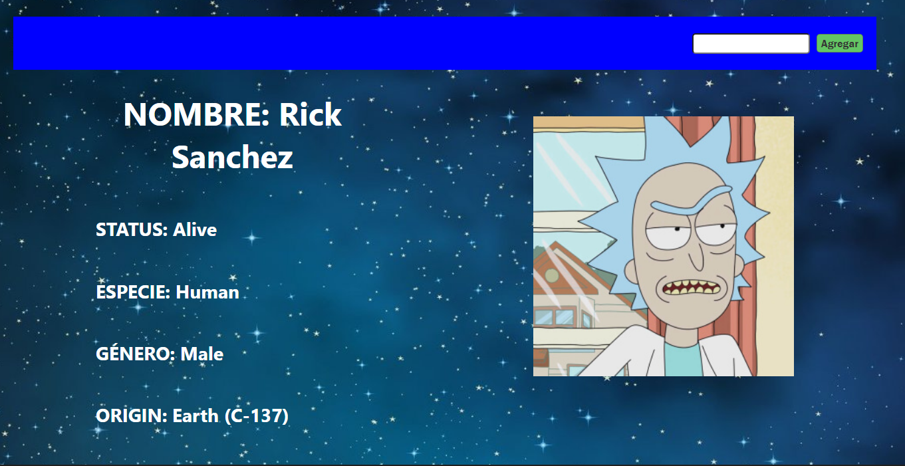

# HW 09 - React-Routing | Integración

## **Duración estimada 🕒**

1 hora y media

<br />

---

## **Rick & Morty App**

### **INTRO**

Continuamos con nuestra Rick & Morty App. Utilizaremos React-Router-DOM el cual nos va a permitir enrutar nuestra SPA. Esto quiere decir que podremos decidir en que path o "link" se renderice cada componente.

Al finalizar, habremos creado tres rutas por las que podremos navegar:

- **"/home"**: esta será la ruta del Home (vista principal/general).
- **"/detail/:detailId"**: en esta ruta encontraremos información más detallada sobre el personaje en particular.
- **"/about"**: en esta ruta colocarás tu nombre y describirás de qué trata la aplicación Rick & Morty.

<br />

---

## **COMENCEMOS**

Vamos a comenzar creando los componentes que nos faltan en nuestra carpeta components. Creamos `About.jsx` y `Detail.jsx` con sus respectivos archivos. Sólo los crearemos, aún no los construiremos. También creamos el archivo `.css` para el estilado. Recuerda que puedes utilizar cualquier formato de estilos (in-line, module, styled components, etc)

Cómo sabemos, `react-router-dom` nos da la posibilidad de crear rutas dinámicas. Estas rutas serán los path o links en el que se renderizará el componente que nosotros decidamos. Para este ejercicio queremos que en cada link se vea lo siguiente:

- `<Nav />` debe que aparecer en todas las rutas.
- `<Cards />` debe aparecer sólo en la ruta `/home`.
- `<About />` debe aparecer sólo en la ruta `/about`.
- `<Detail />` debe aparecer sólo en la ruta `/detail/:detailId`

<br />

---

### **👩‍💻 EJERCICIO 1**

### **Instalar y configurar `react-router-dom`**

Instala `react-router-dom` desde la terminal. Importa y envuelve la aplicación con "**BrowserRouter**" en el archivo index.js.

Importa los elementos "**Routes**" y "**Route**", para que luego definamos las rutas en el archivo app.js.

<br />

---

### **👩‍💻 EJERCICIO 2**

### **Mi perfil**

Ahora si construiremos el componente `<About />`. Este componente será una vista que contenga tu información y una explicación acerca de la aplicación!

Esto significa que es completamente libre. Puedes mostrar incluso una foto tuya. Esto le servirá a las personas que vean tu App para conocer al creador 🤠✨.

En la Navbar agrega el link About que dirija al componente **About** y el link Home para que dirija al componente **Home**.

<br />

---

### **👩‍💻 EJERCICIO 3**

### **Routing time!**

En nuestro archivo "app.js" (aplicación), crea las rutas necesarias para que los componentes `<About />`, `<Cards />` y `<Nav />` se rendericen en sus links correspondientes. Recuerda que en el **EJERCICIO 1** ya están especificadas las rutas.

Respecto al componente `<Detail />`, su ruta recibirá el parámetro **detailId**, por lo que debes asegurarte de escribir bien el path de esta ruta.

> **Nota:** Comprueba en tu navegador que los links rendericen el componente correcto, y que el componente `<Nav />` se vea siempre.

<br />

---

### **👩‍💻 EJERCICIO 4**

### **Detail redirection**

Ahora nuestra SPA cuenta con tres rutas distintas: "`/home`", "`/detail/:detailId`" y "`/about`".

Para este ejercicio:

1. En el componente `<Card />` importa y envuelve el nombre del personaje con el elemento "**Link**". Tiene que redirigirnos a la ruta de cada personaje.
2. A este componente deberás pasarle por **props** el "**id**" del personaje para usarlo en el Link.

```js
// Card.js
...
<Link to={`/detail/${props.id}`} >
  <h5 className="card-title">{props.name}</h5>
</Link>
...
```

<br />

---

### **👩‍💻 EJERCICIO 5**

### **Construcción del Detail**

¡Genial! Cuando hacemos click sobre el nombre en una Card esta nos redirige a la ruta con el ID del personaje. Ahora necesitamos crear el componente que mostrará toda la información del personaje.

Para obtener esta información importa los hooks **useState** de `react` y **useParams** de `react-router-dom` en el componente `<Detail />`.

1. Primero obten el ID del personaje mediante **useParams**.

2. Crea un estado local con el nombre **character**.

3. En este paso importaremos el hook **useEffect** de `react`. Una vez importado, copia el siguiente código y pégalo en el cuerpo del componente.

```js
useEffect(() => {
  fetch(`https://rickandmortyapi.com/api/character/${detailId}`)
    .then((response) => response.json())
    .then((char) => {
      if (char.name) {
        setCharacter(char);
      } else {
        window.alert("No hay personajes con ese ID");
      }
    })
    .catch((err) => {
      window.alert("No hay personajes con ese ID");
    });
  return setCharacter({});
}, [id]);
```

> **NOTA:** Este código es el que buscará al personaje de la API cada vez que el componente se monte. Y luego, cada vez que se desmonte, borrará su información.

<br />

---

### **👩‍💻 EJERCICIO 6**

Ahora en tu estado local **character** tendrás toda la información del personaje disponible para que la renderices en este componente (`<Detail />`). Debes traer la siguiente información:

- Name
- Status
- Specie
- Gender
- Origin
- Image

Dándole estilos debería quedarte algo similar a esto:



<br />

> Hint: Ten en cuenta el tipo de dato de cada propiedad renderizada! Además cuando vayas a renderizar la información puede suceder que al ser la llamada a la API de Rick & Morty asíncrona, no le da tiempo de guardar la información y renderizarla. Para ello, puedes usar "?" para validar si nuestro estado tiene información a renderizar.

---

### **👩‍💻 EJERCICIO 7**

Crea un botón en el componente `<Detail />` que te permita regresar a "`/home`".

<br />

---

### **📌 EXTRA CREDIT**

Ahora te desafiamos a que crees un nuevo componente llamado **Error**. A este componente le podrás dar los estilos que quieras, pero la idea es que se muestre un mensaje de error 404.

Pueden inspirarte en el siguiente link: "https://github.com/errroorrxd".

El desafío es el siguiente: haz que este componente se muestre cada vez que el usuario ingrese a cualquier otra ruta que no exista. Es decir que no la hayas especificado en esta homework. Por ejemplo, si creaste una ruta "`/home`" y "`/about`", y el usuario en el navegador escribe y "`/henry`", debería mostrar el error 404.
