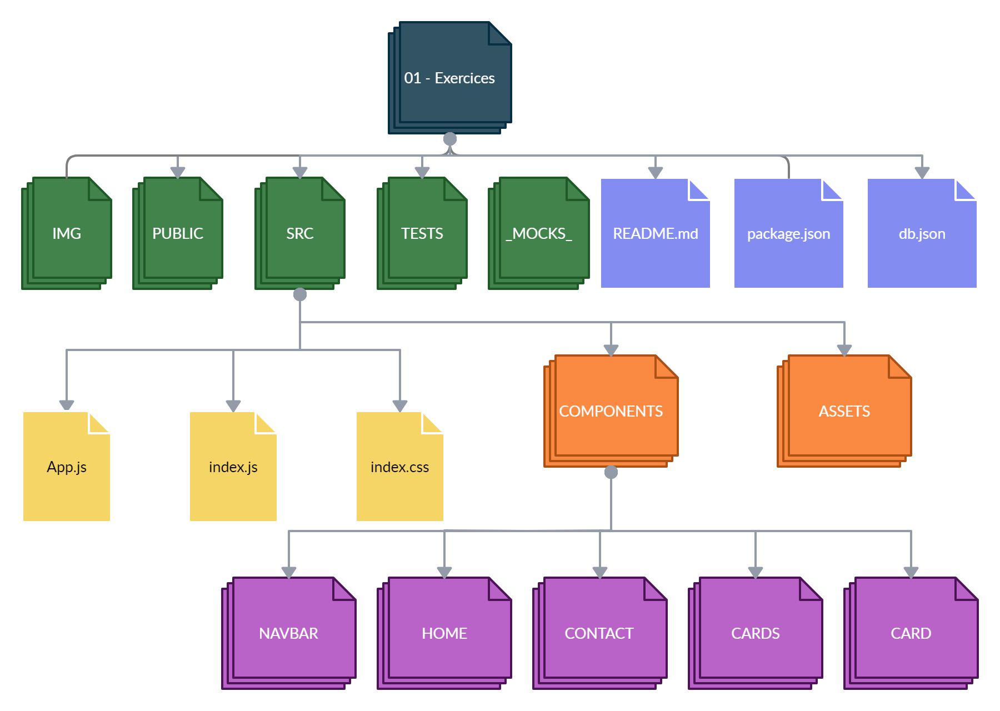

# HW 1: React-Forms | Ejercicios

## **Duración estimada 🕒**

60 minutos

<br />

---

## **INTRO**

En esta homework encontrarás casi terminada la Music App. Sin embargo, deberás solucionarle al usuario la necesidad de que se comunique con la plataforma, posiblemente para dejar un mensaje contando la experiencia y/o sugerencias para la aplicación.

<br />

---

### **CONSIGNA**

-  Crear un formulario controlado.
-  Crear inputs dinámicos.
-  Manejar errores en los inputs.

<br />

---

## **Pasos básicos para realizar la homework**

🔹 Para poder ejecutar los `test` de esta homework es necesario que abramos la terminal ubicados dentro de la carpeta `01 - Exercises`.

-  Cuando te encuentres en esta carpeta, debes ejecutar el comando

```bash
npm install
```

-  Listo!! Ya puedes correr los test:

```bash
npm test
```

Si deseas correr por cada uno de los test, puedes utilizar:

```bash
npm run test:01
```

🔹 Para esta homework necesitarás emular peticiones a una API con el fin de consumir los datos que allí están. Para ello, debes correr el servidor **db.json**, sin este paso no podrás visualizar el resultado esperado y tampoco pasarán los tests. A continuación, los pasos para correr el servidor:

-  Abrir una segunda terminal.
-  En la terminal, dirígete a la carpeta en la que estamos trabajando.
-  Ejecuta el comando:

```bash
npm run server
```

🔹 Para poder correr la aplicación de forma local, sólo debes ejecutar el comando

```bash
npm start
```

-  Ingresando a <http://localhost:3000> desde el navegador, podremos ir viendo en tiempo real el resultado de nuestro trabajo.

<br />

---

## **ESTRUCTURA**

🔹 Dentro de la carpeta `01 - Exercises`, vas a encontrar la siguiente estructura:

-  Una carpeta llamada **_mocks_**
-  Una carpeta llamada **img**
-  Una carpeta llamada **public**
-  Una carpeta llamada `src` (Es la carpeta en donde trabajaremos)
-  Una carpeta llamada **tests**
-  Un archivo **db.json**
-  Un archivo **package.json**
-  Y el archivo `README.md` que ahora mismo estás leyendo. 🧐

Además:

🔹 Dentro de la carpeta `src` encontrarás el esqueleto del proyecto React, estructurado de la siguiente manera:

-  Un carpeta llamada `assets`
-  Una carpeta llamada `components`
-  Un archivo llamado `App.js`
-  Un archivo **index.css**
-  Un archivo `index.js`

🔹 Dentro de la carpeta `components` encontrarás:

-  Una carpeta llamada **Card**, la cual a su vez contiene:
   -  El componente `Card.jsx`
   -  La hoja de estilos Card.module.css
-  Una carpeta llamada **Cards**, la cual a su vez contiene:
   -  El componente `Cards.jsx`
   -  La hoja de estilos Cards.module.css
-  Una carpeta llamada **Contact**, la cual a su vez contiene:
   -  El componente `Contact.jsx`
   -  La hoja de estilos Contact.module.css
-  Una carpeta llamada **Home**, la cual a su vez contiene:
   -  El componente `Home.jsx`
-  Una carpeta llamada **NavBar**, la cual a su vez contiene:

   -  El componente `NavBar.jsx`
   -  La hoja de estilos NavBar.module.css

   

<br />

---

## **👩‍💻 EJERCICIO 1**

### **Crear inputs**

🔹 Abre el archivo `Contact.jsx`. Dentro de él encontrarás el import de **React** y el import de la hoja de estilos **Contact.module.css**.

🔹 Lo que hay que hacer:

1. Crea una etiqueta form.
2. Dentro de la etiqueta form, crear:

-  Una etiqueta label y su texto sea **'Nombre:'**
-  Una etiqueta input con los siguientes atributos:
   -  `name` y su valor sea **name**.
   -  `placeholder` y su valor sea **"Escribe tu nombre..."**
   -  `type` y su valor sea **text**
-  Una etiqueta label y su texto sea **'Correo Electrónico:'**
-  Otra etiqueta input con los siguientes atributos:
   -  `name` y su valor sea **email**.
   -  `placeholder` y su valor sea **"Escribe tu email..."**
   -  `type` y su valor sea **text**
-  Una etiqueta label y su texto sea **'Teléfono:'**
-  Otra etiqueta input con los siguientes atributos:
   -  `name` y su valor sea **phone**.
   -  `placeholder` y su valor sea **"Escribe un teléfono..."**
   -  `type` y su valor sea **number**
-  Una etiqueta label y su texto sea **'Asunto:'**
-  Otra etiqueta input con los siguientes atributos:
   -  `name` y su valor sea **subject**.
   -  `placeholder` y su valor sea **"Escribe el asunto..."**
   -  `type` y su valor sea **text**
-  Una etiqueta label y su texto sea **'Mensaje:'**
-  Una etiqueta textarea con los siguientes atributos:
   -  `name` y su valor sea **message**.
   -  `placeholder` y su valor sea **"Escribe tu mensaje..."**
   -  `type` y su valor sea **text**
-  Una etiqueta botón con el atributo `type` donde su valor sea **submit** y el texto del botón sea **enviar**.

<br />

---

## **👩‍💻 EJERCICIO 2**

### **Estados**

🔹 Ahora agrega estados al componente "**Contact**". Estos estados van a estar conectados con los inputs que creaste en el ejercicio anterior.

🔹 Lo que hay que hacer:

1. Crea un estado llamado `inputs`. El estado debe iniciar en un objeto con las siguientes propiedades:

-  "**name**", su valor debe ser un string vacío.
-  "**email**", su valor debe ser un string vacío.
-  "**phone**", su valor debe ser 0.
-  "**subject**", su valor debe ser un string vacío.
-  "**message**", su valor debe ser un string vacío.

Ejemplo:

```jsx
const [inputs, setInputs] = React.useState({
   name: '',
   email: '',
});
```

2. Crea un segundo estado llamado `errors`. El estado debe iniciar en un objeto con las siguientes propiedades:

-  "**name**", su valor debe ser un string vacío.
-  "**email**", su valor debe ser un string vacío.
-  "**phone**", su valor debe ser un string vacío.
-  "**subject**", su valor debe ser un string vacío.
-  "**message**", su valor debe ser un string vacío.

3. Conecta el estado con el formulario. Para ello, crea el atributo **value** en cada input asignándole el estado correspondiente. Ejemplo:

```jsx
<input name='name' value={inputs.name} />
```

4. Crea la función **handleChange** antes del return. Esta función recibe un `evento` como parámetro y dentro de ella haz lo siguiente:

-  Setea el estado **inputs**.
-  Usa el "_spread operator_" para copiar el estado anterior.
-  Haz que las propiedades y valores del estado sean dinámicas a partir del evento recibido por parámetro (_utilizando ES6_). Ejemplo:

```jsx
[evento.target.name]: evento.target.value
```

5. Crea el atributo `onChange` en los inputs del formulario y asígnale como valor la función **handleChange** previamente creada.

<br />

---

## **👩‍💻 EJERCICIO 3**

### **Manejo de errores**

🔹 En este ejercicio validarás cada input del formulario, cada vez que se actualice el estado, controlando que cumpla con las condiciones requeridas.

🔹 Lo que hay que hacer:

1. Define una función llamada `validate` fuera del componente "**Contact**", que reciba como parámetro el objeto **inputs**. Esta función debe ser exportada para que funcionen los tests. Ejemplo:

```jsx
export function validate() {}
```

Dentro de la función debes hacer lo siguiente:

a) Declara una variable llamada `errors` y que su valor sea un objeto vacío.

b) Valida cada input del formulario que viene del objeto **inputs** que se recibe como parámetro en la función:

-  En el input **name**, si este campo está vacío, agrega la propiedad name al objeto **errors** en donde su valor sea "Se requiere un nombre".
-  En el input **email**, valida si el email que ingresa el usuario coincide con el formato regex de la constante `regexEmail`, aplicándole a esta el método `test()` y dentro de sus paréntesis coloca `inputs.email`; agrega la propiedad email al objeto **errors** en donde su valor sea "Debe ser un correo electrónico".
-  En el input **phone**, valida si el phone que ingresa el usuario es un número positivo; agrega la propiedad phone al objeto **errors** en donde su valor sea "Sólo números positivos".
-  En el input **subject**, si este campo está vacío, agrega la propiedad subject al objeto **errors** en donde su valor sea "Se requiere un asunto".
-  En el input **message**, si este campo está vacío, agrega la propiedad message al objeto **errors** en donde su valor sea "Se requiere un mensaje".

Ejemplo:

```jsx
if (!inputs.name) {
   errors.name = 'Se requiere un nombre';
} else if (!regexEmail.test(inputs.email)) {
   errors.email = 'Debe ser un correo electrónico';
}
```

c) La función debe retornar el objeto errors.

d) En la función **handleChange**:

-  Setea el estado **errors** y que éste reciba la función `validate`.
-  Usa el spread operator para copiar el estado anterior.
-  Haz que las propiedades y valores del estado sean dinámicas a partir del evento recibido por parámetro (_utilizando ES6_). Ejemplo:

```jsx
setErrors(
   validate({
      ...inputs,
      [e.target.name]: e.target.value,
   })
);
```

e) Debes informar a los usuarios que tiene errores en los inputs. Para ello, haz lo siguiente:

1. Lee la hoja de estilos llamada `Contact.modules.css`, dentro de ella encontrarás:

   a) Una clase llamada `.warning` con la propiedad **border** y donde sus valores son: **solid**, **red** y 1 px.

   b) Además verás otra clase llamada `danger` con la propiedades:

   -  font-size: 10px.
   -  color: red.
   -  margin-left: 10em.

2. En cada input crea el atributo **className** y asigna condicionalmente la propiedad del estado errors de acuerdo al input en el que te encuentres. Ejemplo:

```jsx
<input className={errors.name && 'warning'}>
```

3. Debajo de cada input (si existe un error) agrega una etiqueta `p` debajo, en el que su texto sea la propiedad del objeto errors de acuerdo al input que te encuentres validando.
4. Agrega en la etiqueta **p** el atributo className y asígnale la clase `'danger'`.

Ejemplo:

```jsx
<p className='danger'>{errors.name}</p>
```

<br />

---

## **👩‍💻 EJERCICIO 4**

### **...estamos llegando a la última parte de la homework ⭐**

### **Envío de formulario**

🔹 Ahora solo nos falta "enviar" el formulario.

🔹 Lo que hay que hacer:

1. Define una función llamada `handleSubmit` que reciba un **evento** como parámetro. En ella realizarás la lógica que ejecutará el formulario cuando el usuario de click en el botón **Enviar**.
2. Dentro de la función:

-  Utiliza el método `preventDefault()` del parámetro **evento** para prevenir que el formulario se envíe por defecto.
-  Convierte el estado **errors** en un array para medir su longitud, si es igual a 0, muestra un alert con un mensaje, por ejemplo, "Datos completos" y setea los estados **inputs** y **errors** en su estado original (recuerda que `errors` tiene la función validate); **en caso contrario**, muestra un alert con otro mensaje, por ejemplo, "Debe llenar todos los campos".

3. Crea el atributo `onSubmit` a la etiqueta **form** y asígnale la función **handleSubmit**.

> Para esta instancia deben pasar todos los tests. ✅ 🏆

🔹 Resultado esperado:

<p align="center"></p>

<br />

---

## **🧠 Recuerda que...**

-  Un formulario controlado es cuando el estado maneja los valores de los inputs y lo actualiza de acuerdo a los eventos del mismo usando setState.
-  El evento.preventDefault() permite prevenir el comportamiento predeterminado de un submit.😃
-  Con la propiedad target del evento, puedes setear las propiedades de un estado dinámicamente el name y value de cada input del formulario.
-  Formula siempre qué datos quieres recibir y qué experiencia quieres dar al usuario, en el momento que definas las funciones handleChange y handleSubmit.

<br />

---

## **🔎 Recursos adicionales**

-  Documentación [**Formularios**](https://es.reactjs.org/docs/forms.html)
-  Documentación [**Regular Expressions**](https://developer.mozilla.org/en-US/docs/Web/JavaScript/Guide/Regular_Expressions)

---

Listo!! Aprendiste cómo funcionan las rutas en React!! ✨🚀 Dirígete a la carpeta 📂 [**"02 - Integration"**](../02%20-%20Integration/README.md) y continúa desarrollando la app de Rick & Morty 🤩 ---
