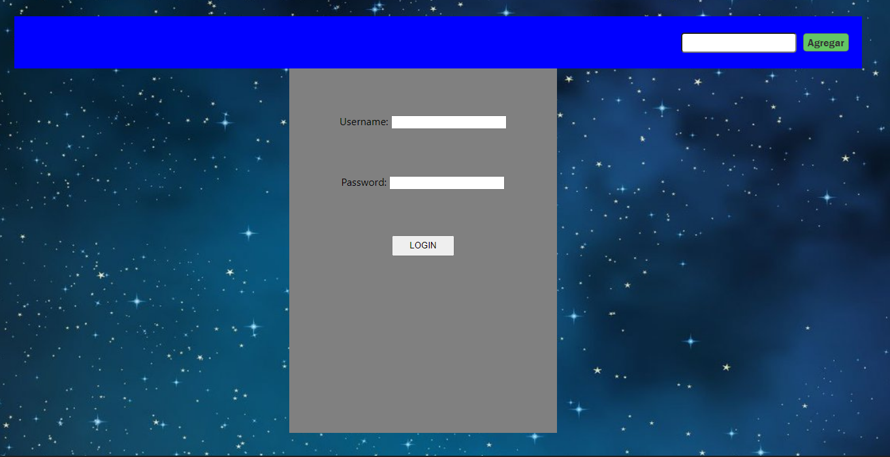
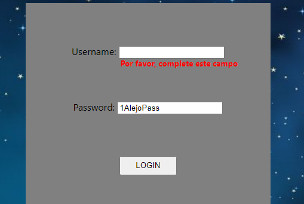

## HW 10: React-Forms | Integración

## **Duración estimada 🕒**

60 minutos

<br />

---

## **Rick & Morty App**

### **INTRO**

En la integración de hoy crearemos un formulario de login. Así, cada vez que ingresemos a nuestra app tendremos que logearnos para utilizarla. Tanto el formulario como sus validaciones las haremos con Javascript.

Nuestro formulario va a estar compuesto de:

-  Username: el nombre de usuario tiene que ser un email, si no, tiene que mostrar un error.
-  Password: la contraseña tiene que contener por lo menos un número y tener una longitud de entre 6 y 10 caracteres, si no debe mostrar un error.

<br />

---

## **COMENCEMOS**

Vamos a comenzar creando el componente que nos falta en nuestra carpeta components. Creamos `Form.jsx` con su respectivo archivo `.css` para darle estilos.

---

### 👩‍💻 EJERCICIO 1

### Estructura

Vamos a trabajar en el archivo `Form.jsx` que acabas de crear.

Primero agregaremos una etiqueta `<div />` que envolverá a todo el componente. Tiene que haber una etiqueta `<label />` y una `<input />` tanto para el **username** como para la **password**. Por último, agrega una etiqueta `<button />`.

Dale algo de estilos al componente. Te dejamos una plantilla de cómo puede quedar!



<br />

---

### **👩‍💻 EJERCICIO 2**

### **Ruteo**

Ahora deberás cumplir los siguientes dos pasos:

1. Crea una ruta en el archivo `app.jsx` para que el formulario se renderice en el path "`/`".
2. Si obervas la imagen del ejercicio anterior, la barra de navegación también se muestra en el **Login**. Cambia esto de modo que el `<Nav />` se muestre en todos lados, menos en el **Login**.

> **PISTA:** investiga sobre el hook "useLocation" de react-router-dom, y piensa cómo hacer un renderizado condicional.

<br />

---

### **👩‍💻 EJERCICIO 3**

### **Estado del formulario**

El siguiente paso es poder controlar nuestro formulario. Para esto trabajaremos con un estado local con esta estructura:

```js
// Form.jsx
const [userData, setUserData] = React.useState({ username: '', password: '' });
```

Ahora conecta tu estado local con los inputs correspondientes utilizando la propiedad `value`.

Por último, usaremos el evento `onChange` en ambos inputs para poder guardar la información del usuario. Te sugerimos que crees una función **handleInputChange** la cual reciba el evento del input, y a partir de esta se modifique el estado local.

<br />

---

### **👩‍💻 EJERCICIO 4**

### **Validaciones**

En tu componente `<Form />` crea un nuevo estado local llamado "**errors**". Este es el estado que usarás para encontrar errores en el formulario.

Luego crea un nuevo archivo en la carpeta de tu componente Form.jsx con el nombre "**validation.js**". Aquí dentro deberás crear una función que valide lo siguiente:

**USERNAME**

-  el nombre de usuario tiene que ser un email _(explora validaciónes REGEX en internet!)_.
-  el nombre de usuario no puede estar vacío.
-  el nombre de usuario no puede tener más de 35 caracteres.

**PASSWORD**

-  la contraseña tiene que tener al menos un número.
-  la contraseña tiene que tener una longitud entre 6 y 10 caracteres.

No te olvides de renderizar y darle estilos a tus errores! Te dejamos un ejemplo de cómo puede quedar.



<br />

---

### **👩‍💻 EJERCICIO 5**

### **Simulación de seguridad**

Ahora simularemos una base de datos donde esté guardado un username y password. De esta forma, solo si la información de usuario coincide podrá usar la aplicación. Para esto:

1. En el archivo `App.js` crea lo siguiente:

   -  Un estado local llamado "**access**" que se inicialice en `false`.
   -  Una variable llamada "**username**", y que sea igual a tu email.
   -  Una variable "**password**", y que sea igual a una contraseña.

2. Crea una función llamada "**login**" que reciba por parámetro "_userData_". Esta función tiene que preguntar si el username y password que declaraste más arriba son iguales a los que les está llegando por parámetro. En caso afirmativo, el estado local access ahora será `true`. Importa el hook "**useNavigate**" de `react-router-dom` y haremos que nos redirija a `/home` si la información es correcta.

```jsx
const navigate = useNavigate();
const [access, setAccess] = useState(false);
const username = 'ejemplo@gmail.com';
const password = '1password';

function login(userData) {
   if (userData.password === password && userData.username === username) {
      setAccess(true);
      navigate('/home');
   }
}
```

3. Por último, lleva el siguiente código a tu componente (no te olvides de importar el `useEffect`).

```javascript
//App.js
useEffect(() => {
   !access && navigate('/');
}, [access]);
```

Esto no nos dejará navegar por la aplicación, al menos que ingresemos la información correcta!

<br />

---

### **👩‍💻 EJERCICIO 6**

### **Login**

Ahora le daremos la funcionalidad de cambiar los permisos a nuestro login! Para esto:

1. En el archivo `App.js`, le pasaremos la función **login** que creaste en el ejercicio anterior por props al componente `<Form />`.

2. En el componente `<Form />`, crea una función "**handleSubmit**". Esta función por dentro sólo debe ejecutar la función "**login**" recibida por props. No te olvides de pasarle por parámetro tu estado local _userData_!

¡Listo! Ya tienes un Login funcional!!😀🥳🤓

Pruebalo ingresando la información que declaraste previamente.

<br />

---

### **📌 EJERCICIO EXTRA**

-  Ahora te desafiamos a que crees un botón "**Logout**" en tu componente `<Nav />`. Si lo presionas debe quitar los permisos de acceso y redirigirte automáticamente a tu componente `<Form />`.

> **PISTA:** lo puedes hacer creando una función **logout** en tu archivo App.js.
