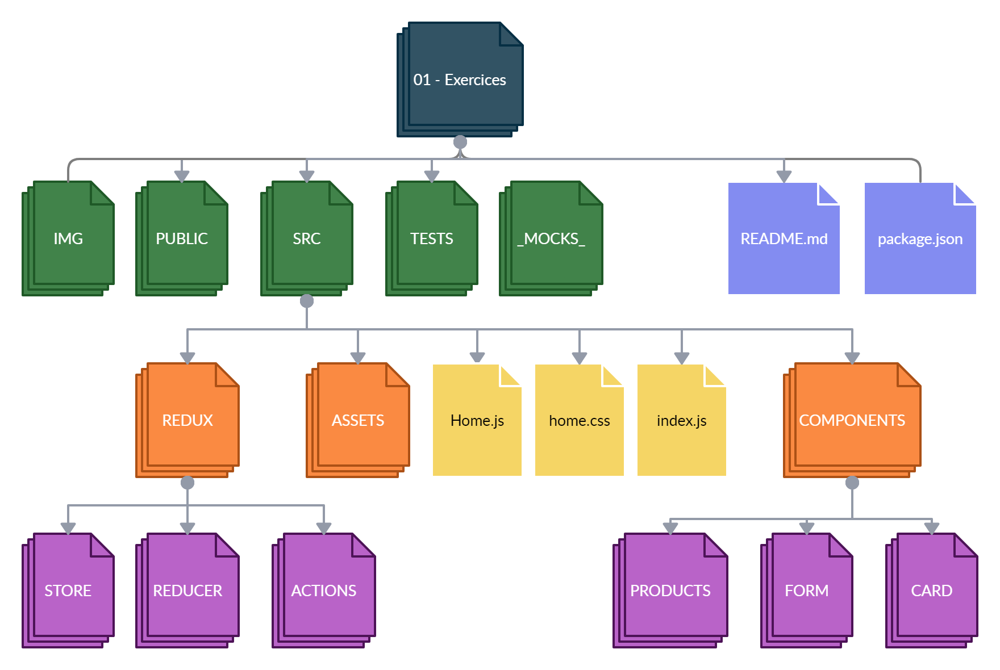

# HW 12: React-Redux | Ejercicios

## **Duración estimada 🕒**

x minutos

<br />

---

## **INTRO**

En esta homework desarrollarás una aplicación que le permite al usuario agregar y eliminar productos de una lista de compras.

<br />

---

### **CONSIGNA**

-  Agregar productos a una lista de compras.
-  Eliminar productos de la lista de compras.

<br />

---

## **Pasos básicos para realizar la homework**

🔹 Para poder ejecutar los `test` de esta homework, es necesario que abramos la terminal ubicados dentro de la carpeta `01 - Exercises`.

-  Cuando te encuentres en esta carpeta, debes ejecutar el comando

```bash
npm install
```

-  Listo!! Ya puedes correr los test:

```bash
npm test
```

Si deseas correr por test, puedes utilizar:

```bash
npm run test:01
```

🔹 Para poder correr la aplicación de forma local, sólo debes ejecutar el comando

```bash
npm start
```

-  Ingresando a <http://localhost:3000> desde el navegador, podremos ir viendo en tiempo real el resultado de nuestro trabajo.

---

## **ESTRUCTURA**

🔹 Dentro de la carpeta `01 - Exercises`, vas a encontrar la siguiente estructura:

-  Una carpeta llamada **mocks**.
-  Una carpeta llamada **public**.
-  Una carpeta llamada **tests**.
-  Una carpeta llamada **img**.
-  Un archivo **package.json**
-  Una carpeta llamada `src` (Es la carpeta en donde trabajaremos)
-  Y el archivo `README.md` que ahora mismo estás leyendo. 🧐

Además:

🔹 Dentro de la carpeta `src` encontrarás el esqueleto del proyecto React, estructurado de la siguiente manera:

-  Una carpeta llamada `assets`
-  Una carpeta llamada `components`
   -  Una carpeta llamada `Card`
   -  Una carpeta llamada `Form`
   -  Una carpeta llamada `Products`
-  Una carpeta llamada `redux`
   -  Una carpeta llamada `actions`
   -  Una carpeta llamada `reducer`
   -  Una carpeta llamada `store`
-  Un archivo llamado `Home.js`
-  Un archivo llamado `home.css`
-  Un archivo llamado `index.js`

Estarás trabajando con algunos componentes y con las herramientas de Redux.

🔹 Da un vistazo al archivo `index.js`, dentro de la carpeta **store**, para que veas cómo se configura el store.



<br />

---

## **👩‍💻 EJERCICIO 1**

### **ACTIONS**

🔹 Dentro de la carpeta **actions**, encontrarás dos archivos:

-  `actions.js`: en este archivo harás las funciones _action creators_ para gestionar tu lista de compras (agregar, editar o eliminar productos).
-  `types.js`: en este archivo guardarás los types para enviar a tu reducer.

🔹 Lo que hay que hacer:

1. En el archivo **types.js**, crea y exporta las siguientes constantes:

-  ADD_PRODUCT: que su valor sea 'ADD_PRODUCT'.
-  DELETE_PRODUCT: que su valor sea 'DELETE_PRODUCT'.

2. En el archivo **actions.js**, importa las constantes que están en el archivo **types.js**.

   > NOTA: puedes utilizar destructuring para importar los types.

3. Define y exporta una función llamada addProduct que recibe como parámetro `product`. Esta función debe retornar la propiedad **type** con el valor ADD_PRODUCT, y la propiedad **payload** con el valor que recibe por parámetro la función.

4. Define y exporta una función llamada deleteProduct que recibe como parámetro `id`. Esta función debe retornar la propiedad **type** con el valor DELETE_PRODUCT, y la propiedad **payload** con el valor que recibe por parámetro la función.

<br />

---

## **👩‍💻 EJERCICIO 2**

### **REDUCER**

🔹 Dentro de la carpeta **reducer**:

Si observas, el **Initial State** (tu estado global) ya está declarado, y más abajo se esta exportando por defecto una función **rootReducer** que aún no ha sido creada (ambos estan comentados). Por lo tanto, debes descomentar las líneas y seguir los siguientes pasos.

🔹 Lo que hay que hacer:

1. Importa las constantes que están en el archivo **types.js**.

2. Crea una función llamada **rootReducer** que reciba como parámetro:

   -  Una variable _**state**_, que sea igual al _initialState_ ya declarado.
   -  Una variable **_action_** (puedes hacer _destructuring_ de sus dos propiedades).

3. Dentro de esta función crea una declaración **switch** que reciba por parámetro la propiedad _**type**_ de la _action_.

4. Dentro de esta declaración **switch** crearemos dos casos distintos, y un caso _default_.

   **Caso A)** El nombre de este caso será **ADD_PRODUCT**. Lo que hará es obtener tu propiedad **list** del estado global mediante un _**spread operator**_. Luego le insertarás lo que recibes por _payload_ (recuerda que **list** es un arreglo, así que ya te imaginarás qué propiedad usar...). Una vez insertado, retornará un objeto en el cual se haga un _**spread operator**_ del estado, y la propiedad **list** será igual al nuevo arreglo (que contiene el payload recibido).

   ```javascript
   [...state.list];
   ```

   **Caso B)** El nombre de este caso será **DELETE_PRODUCT**. Lo que hará es tomar el arreglo de objetos **list**, y buscar aquel producto que tenga el mismo id que se recibe por la propiedad _payload_. Filtraremos ese producto y nos quedaremos con todos los demás. Una vez que tengamos el resto de productos retornará un objeto en el cual se haga un _**spread operator**_ del estado, y la propiedad **list** será igual al nuevo arreglo (que ha filtrado el producto recibido por payload).

   > NOTA: ten en cuenta que para filtrar los productos deberás ingresar a la propiedad id de cada uno y comparar si el id recibido por payload es igual.

   **Caso default)** El caso default de este switch sólo retornará el estado.

<br />

---

## **👩‍💻 EJERCICIO 3**

### **COMPONENTE FORMULARIO**

🔹 Dentro de la carpeta **Form**:

Revisa lo que tiene por un momento. Verás que el componente tiene un formulario controlado, con el cual un usuario podrá agregar un nuevo producto a la lista de compras. Para que esto funcione correctamente deberás hacer lo siguiente:

🔹 Lo que hay que hacer:

1. Importa en este archivo la _action_ llamada "**addProduct**".

2. Termina de crear la función **mapDispatchToProps**. Esta función debe recibir por parámetro "_dispatch_". En el cuerpo de la función se debe retornar un objeto con una propiedad llamada "_addProduct_" que será igual a una función que recibe por parámetro `product`, y que en su cuerpo hace un dispatch de la _action_ que importaste en el paso anterior. Recuerda que esa action recibe por parámetro `product`.

3. Este componente debe recibir por props la función "_addProduct_". Te recomendamos que la recibas haciendo _**destructuring**_.

4. Crea una función (dentro del cuerpo del componente `Form`) llamada **handleSubmit**. Esta función ejecutará la función recibida por props: `addProduct`. A ésta le pasaremos como argumento el estado local llamado "product" en forma de _**spread operator**_. De esta forma también indicaremos que la propiedad **id** va a ser igual a la función **now()** del objeto global _Date_.

```javascript
Date.now();
```

Esto le permitirá a cada producto tener un ID único.

5. Una vez hecho esto, ve al botón que se encuentra en el componente, y mediante un evento `onClick`, pásale esta función recién creada.

> **NOTA:** prueba ejecutar la función _Date.now()_ en tu consola y verifica qué respuesta te da.

<br />

---

## **👩‍💻 EJERCICIO 4**

### **COMPONENTE PRODUCTS**

🔹 Dentro de la carpeta **Products**:

Lo que hará este componente será renderizar nuestra lista de productos en el navegador. Para esto tómate un momento para explorar este componente y revisar lo que tiene dentro. Luego resuelve:

🔹 Lo que hay que hacer:

1. Importa el componente `Card` que, como verás, ya está importado y sólo debés descomentarlo. (No cambiar la manera en la que se importa, porque sino fallarán los test)

2. Termina de crear la función **mapStateToProps**. Esta recibe por parámetro _state_. En el cuerpo de esta función se retornará un objeto que tenga como propiedad _list_, y que será igual a "_state.list_".

3. El componente `Products` recibe por props nuestro estado global "**list**". Te recomendamos que las recibas haciendo _**destructuring**_.

4. Ahora renderizaremos nuestra lista de productos. Utiliza el método **map** para mapear la propiedad **list**. Por cada producto en esta lista deberás renderizar un componente _**Card**_ (importado previamente). A este componente `Card` pásale como propiedades el **name**, el **price**, el **id** de cada producto, y una **key** que los pueda diferenciar.

<br />

---

## **👩‍💻 EJERCICIO 5**

### **...estamos llegando a la última parte de la homework ⭐**

### **FUNCIONALIDAD DELETE**

🔹 Dentro de la carpeta **Card**:

En este ejercicio crearemos la funcionalidad de eliminar productos de nuestra lista.

🔹 Lo que hay que hacer:

1. Importa la _action_ **deleteProduct**.

2. Termina de crear la función **mapDispatchToProps**. Esta función recibe por parámetro a `dispatch`. En el cuerpo de esta función se retorna un objeto con una propiedad llamada **deleteProduct**, que será igual a una función que recibe por parámetro **_id_**, y que en su cuerpo hará un dispatch de la _action_ previamente importada. Ten en cuenta que al ejecutarse esta acción estará enviando por parámetro el _id_.

3. El componente `Card` recibe por props nuestra función "**deleteProduct**". Te recomendamos que la recibas haciendo _**destructuring**_.

4. Crea una función llamada **handleDelete** en el cuerpo del componente. Esta función debe ejecutar la función _deleteProduct_ que le llega por props, pasando como argumento el id del producto. Una vez creada, mediante un evento `onClick`, haz que el botón de eliminar maneje esta función.

¡Listo! Ahora cuando apretes el botón de eliminar, la card desaparecerá.

> Para esta instancia deben pasar todos los tests. ✅ 🏆

<br />

---

## **📌 EJERCICIO EXTRA**

Si llegaste hasta aquí te desafiamos a que intenes hacer lo siguiente:

-  Haz que el formulario se limpie una vez agregado un producto a nuestra lista.
-  Crea validaciones en el formulario para agregar productos.
   -  Que no deje crear productos sin nombre o sin precio.
   -  Que no deje crear dos productos con el mismo nombre.
-  Haz que siempre pueda haber como máximo un total de 9 cards.

<br />

---

## **🧠 Recordemos que...**

-  El **mapDispatchToProps** sirve para enviar información al _reducer_, y en definitiva, al estado global.
-  El **mapStateToProps** sirve para traer información del estado global a un componente.
-  Las **actions** son las que transportan la información que se despacha de un componente al reducer.
-  El **reducer** es el que gestiona la información de nuestro estado global.

<br />

---

## **🔎 Recursos adicionales**

-  Documentación [**React-Redux**](https://react-redux.js.org/)
-  Documentación [**mapDispatchToProps**](https://react-redux.js.org/using-react-redux/connect-mapdispatch)
-  Documentación [**mapStateToProps**](https://react-redux.js.org/using-react-redux/connect-mapstate)

<br />

---

¡Listo! Aprendiste cómo conectar React con Redux, y los beneficios de tener un estado global.

✨🚀 Dirígete a la carpeta 📂 [**"02 - Integration"**](../02%20-%20Integration/README.md) y continúa desarrollando la app de Rick & Morty 🤩 ---
