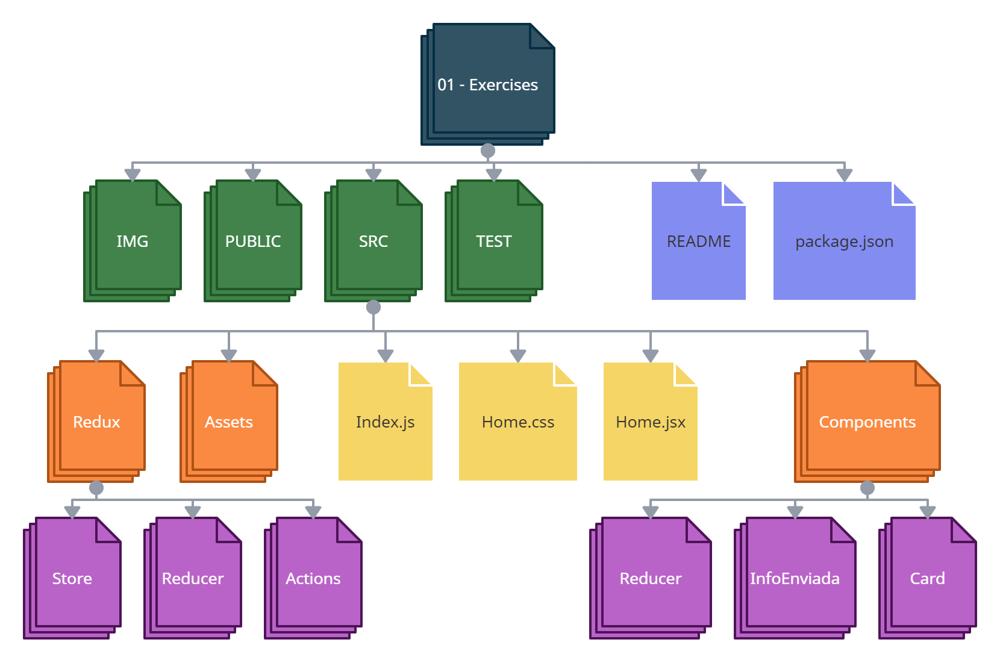

# HW 13: React-Hooks | Ejercicios

## **Duración estimada 🕒**

2 horas

<br />

---

## **INTRO**

En esta homework trabajarás en una serie de ejercicios específcos para crear una página de Contact Us. En cada ejercicio practicarás un **Hook** de React o de Redux.

<br />

---

### **CONSIGNA**

Lee atentamente este **README** y realiza cada uno de los ejercicios.

<br />

---

## **Pasos básicos para realizar la homework**

🔹 Para poder ejecutar los `test` de esta homework, es necesario que abramos la terminal ubicados dentro de la carpeta `01 - Exercises`.

- Cuando te encuentres en esta carpeta, debes ejecutar el comando

```bash
npm install
```

- Listo!! Ya puedes correr los test y levantar el proyecto con los comandos:

```bash
npm test
npm start
```

Si deseas correr por test, puedes utilizar:

```bash
npm run test:01
```

🔹 Para visualizar la aplicación desde el navegador, debes abrir una segunda terminal y ejecutar el comando:

```bash
npm start
```

Ingresando a <http://localhost:3000> desde el navegador, podrás ver en tiempo real el resultado de nuestro trabajo.

---

## **ESTRUCTURA**

🔹 Dentro de la carpeta `01 - Exercises`, vas a encontrar la siguiente estructura:

- Una carpeta llamada **img**.
- Una carpeta llamada **public**.
- Una carpeta llamada `src` (es la carpeta en donde trabajaremos).
- Una carpeta llamada **tests**.
- Una carpeta llamada **mocks**.
- Un archivo **package.json**.
- Y el archivo `README.md` que ahora mismo estás leyendo. 🧐

Además:

🔹 Dentro de la carpeta `src` encontrarás el esqueleto del proyecto React, estructurado de la siguiente manera:

- Una carpeta llamada `assets`
- Una carpeta llamada `components`
  - Una carpeta llamada `ContactUs`
  - Una carpeta llamada `CopyData`
  - Una carpeta llamada `InfoEnviada`
- Una carpeta llamada `redux`
  - Una carpeta llamada `actions`
  - Una carpeta llamada `reducer`
  - Una carpeta llamada `store`
- Un archivo llamado `Home.js`
- Un archivo llamado `home.css`
- Un archivo llamado `index.js`

Estarás trabajando con algunos componentes y con las herramientas de Redux.



<br />

---

## **👩‍💻 EJERCICIO 1**

El objetivo de este ejercicio es crear un formulario para que los usuarios puedan contactar y enviar un mensaje a la aplicación de la empresa.

### **USE STATE**

🔹 Dirígete al archivo **components/ContactUs/ContactUs.jsx**.

🔹 Lo que hay que hacer:

1. Encontrarás importado `React` para que luego puedas usar su método `React.useState`.

2. Crea un estado local llamado "**_form_**" para guardar la información de todos los inputs: **nombre**, **email**, **asunto** y **mensaje**.

   ```js
   const [form, setForm] = React.useState({
     nombre: "",
     email: "",
     asunto: "",
     mensaje: "",
   });
   ```

3. Crea una función "**_handleInput_**", en ella debes hacer lo siguiente:

   a. Recibir como parámetro un evento.

   b. Setear el estado local **form**.

   c. Asignar el valor del evento a cada una de las propiedades.

4. Con el atributo `onChange` de cada input del formulario asigna la función creada en el punto anterior.

<br />

---

## **👩‍💻 EJERCICIO 2**

En este ejercicio crearás todo el flujo para enviar la información del formulario al estado global.

### **USE DISPATCH**

##### **ACTIONS**

🔹 Dirígete al archivo **redux/actions/actions.js**.

🔹 Lo que hay que hacer:

1. Crea y exporta una _**actionCreator**_ llamada "**enviarForm**".

2. Debe recibir por parámetro una variable "_formulario_".

3. Debe retornar una acción con tipo "**FORM_DATA**", y en el payload el formulario recibido por parámetro.

</br>

##### **REDUCER**

🔹 Dirígete al archivo **redux/reducer/reducer.js**.

🔹 Lo que hay que hacer:

1. Crea un control de flujo tipo **switch** dentro de la función **rootReducer**. Este recibirá por parámetro la variable **type**.

2. Crea un caso llamado "**FORM_DATA**". Este caso debe retornar el estado global, pero guardando el payload recibido en la propiedad "_formulario_".

3. Crea un caso **default** en el que se retorne el estado global completo.

 </br>

##### **DISPATCH**

🔹 Dirígete al archivo **components/ContactUs/ContactUs.jsx**.

🔹 Lo que hay que hacer:

1. Importa el hook `useDispatch`. Instáncialo dentro del componente de esta manera:

```javascript
const dispatch = useDispatch();
```

2. Importa la _actionCreator_ que declaraste hace unos momentos atrás.

3. Crea una función llamada "**_handleSubmit_**". Esta función debe:

   - Despachar esta _actionCreator_, la cual recibe por parámetro el estado local "**form**".
   - Limpiar el formulario una vez despachada la información.

4. Pásale esta función a la etiqueta `form` de este componente, dentro de su atributo "**onSubmit**.

5. Agrega a la etiqueta `button` de este componente, el atributo **type** y su valor sea **submit** .

<br />

---

## **👩‍💻 EJERCICIO 3**

En este ejercicio traerás la información del estado global a un componente.

### **USE SELECTOR**

##### **SELECTOR**

🔹 Dirígete al archivo **components/InfoEnviada/InfoEnviada.jsx**.

🔹 Lo que hay que hacer:

1. Importa el hook `useSelector`. Una vez importado, inicialízalo dentro del componente trayendo tu estado global "**formulario**" de la siguiente manera:

```javascript
const { formulario } = useSelector((state) => {
  return state;
});
```

 </br>

##### **GUARDAR LA INFORMACIÓN**

🔹 Continuamos en el archivo **components/InfoEnviada/InfoEnviada.jsx**.

🔹 Lo que hay que hacer:

- Crea un estado local llamado "**informacion**" usando el hook **React.useState**. Este estado debe ser un objeto con las propiedades: **nombre**, **email**, **asunto** y **mensaje**.

<br />

---

## **👩‍💻 EJERCICIO 4**

En este ejercicio mostrarás la información de tu estado global en el navegador.

### **USE EFFECT**

##### **EFFECT**

🔹 Continuamos en el archivo **components/InfoEnviada/InfoEnviada.jsx**.

🔹 Lo que hay que hacer:

- Usa el hook `useEffect`, y decláralo dentro del componente (debajo del selector). Tendrás que declararlo de la siguiente manera:

```javascript
React.useEffect();
```

2. Este hook recibe una función _callback_ la cual debe settear el estado local "**informacion**" y asignar a cada propiedad, el valor de las propiedades del formulario que traes mediante el hook useSelector desde el reducer.

3. Agrega al hook useEffect como segundo argumento un arreglo de dependencia que incluya el formulario recibido desde el reducer.

</br>

##### **RENDER DE LA INFORMACIÓN**

🔹 Continuamos en el archivo **components/InfoEnviada/InfoEnviada.jsx**.

🔹 Lo que hay que hacer:

1. Renderiza una etiqueta h1 que contenga el texto `Información que enviaste por el formulario...`.

2. Renderiza una etiqueta h3 que contenga la propiedad `nombre` del estado `informacion`.

3. Renderiza una etiqueta h3 que contenga la propiedad `email` del estado `informacion`.

4. Renderiza una etiqueta h3 que contenga la propiedad `asunto` del estado `informacion`.

5. Renderiza una etiqueta h3 que contenga la propiedad `mensaje` del estado `informacion`.

6. Dale los estilos que gustes a cada etiqueta.

<br />

---

## **👩‍💻 EJERCICIO 5**

### **...estamos llegando a la última parte de la homework ⭐**

En este ejercicio crearás una funcionalidad de _**Copiado al Portapapeles**_ del número telefónico de la empresa.

### **USE REF**

🔹 Dirígete al archivo **components/CopyData/CopyData.jsx**.

🔹 Lo que hay que hacer:

1.  Usa los hooks `useState` y `useRef`.

2.  Crea un estado local llamado "**number**", donde su estado inicial sea un string con números a tu elección, siguiendo la siguiente estructura:

    XXX-XXX-XXXX

3.  Crea una constante llamada "**numberRef**" que será igual a la ejecución del hook `useRef()`.

4.  El componente funcional CopyData debe renderizar:

    - Una etiqueta `button` con el texto "**_Copy_**"
    - Una etiqueta `div`. A esta etiqueta debes agregar el atributo **ref** donde su valor sea la constante **numberRef**. Además, dentro de esta etiqueta debes escribir:

      ```jsx
      Teléfono: {number}
      ```

    > **NOTA:** es muy importante que el texto que escribas dentro de la etiqueta "div" sea literalmente el anterior, debido a que se tomará como referencia, el valor de tu estado local.

5.  Crea una función llamada **handleCopy**. En el cuerpo de la función tienes que copiar y pegar el siguiente código:

```javascript
let copyText = numberRef.current.lastChild.data;
const textArea = document.createElement("textarea");
textArea.textContent = copyText;
document.body.append(textArea);
textArea.select();
document.execCommand("copy");
textArea.remove();
```

> **NOTA:** este código sirve para que el número de télefono se copie en el portapapeles del usuario. No es importante que entiendas qué está sucediendo en ese código, pero te invitamos a que lo analices.

6. Pásale la función **handleCopy** a la etiqueta `button` que creaste anteriormente, mediante un evento **onClick**.

> Para esta instancia deben pasar todos los tests. ✅ 🏆

<br />

---

## **📌 EJERCICIO EXTRA**

##### **VALIDACIONES**

Te desafiamos a que crees las validaciones necesarias para cada uno de los inputs del formulario.

<br />

---

## **🧠 Recuerda que...**

- El **useState** nos permite guardar información de manera local en un componente.
- El **useDispatch** nos permite enviar acciones a nuestro reducer.
- El **useSelector** nos permite traer información de nuestro estado global a un componente.
- El **useEffect** nos permite manejar el ciclo de vida de un componente.
- El **useRef** nos permite tener una referencia directa de un elemento del DOM en nuestro código.

<br />

---

## **🔎 Recursos adicionales**

- Documentación [**HOOKS EN REACT**](https://reactjs.org/docs/hooks-intro.html)

<br />

---

¡Listo! Repasaste algunos de los hooks más importantes que nos brindan las librerías de React y Redux.

✨🚀 Dirígete a la carpeta 📂 [**"02 - Integration"**](../02%20-%20Integration/README.md) y continúa desarrollando la app de Rick & Morty 🤩 ---
